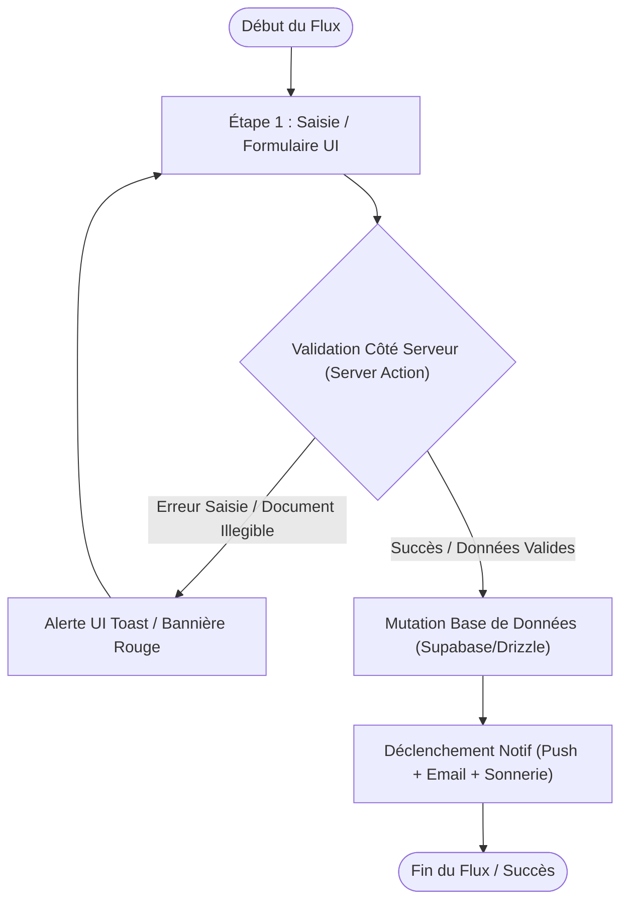

# Procédure de Flux : [Nom du Flux Utilisateur / Onboarding]

> [!IMPORTANT]
> **Positionnement Officiel : Favor Company International — Promoteur Immobilier Agréé**
> Document d'architecture fonctionnelle et cartographie de flux. Conçu pour une présentation aux investisseurs, à la direction, aux audits légaux et aux utilisateurs finaux.

---

## 1. Synthèse Exécutive (Executive Overview)

* **Famille de Flux** : `[ex: 01_Onboarding, 02_KYC, 03_Paiements, 04_Biens, 05_Moderation]`
* **Code du Flux** : `FLOW-[CATEGORIE]-[ID]`
* **Acteur Principal** : `[Client Privé / Manager / Agent Commercial / Administrateur]`
* **Objectif Fonctionnel** : `[Brève description claire de ce que le flux accomplit]`
* **Préréquis & Conditions d'entrée** : `[ex: Compte client authentifié, KYC vérifié, etc.]`
* **Livrables & État final** : `[ex: Facture PDF générée, Statut DB mis à 'verified', Notif push envoyée]`

---

## 2. Matrice d'Habilitation RBAC (Rôles & Permissions)

| Rôle Utilisateur | Niveau d'Accès | Actions Autorisées dans ce Flux |
| :--- | :--- | :--- |
| **Client Privé** | `client` | Soumission des formulaires, consultation du statut, téléchargement des reçus. |
| **Manager / Agent** | `agent` | Modération de premier niveau, suivi de dossier, notification. |
| **Administrateur** | `admin` | Validation finale, annulation de transaction, réattribution. |
| **Super Admin** | `super_admin` | Audit global, override système, consultation des métriques. |

---

## 3. Cartographie du Flux (Diagramme Mermaid)

---

## 4. Déroulé Détaillé des Étapes (Step-by-Step Execution)

### Étape 1 : [Nom de l'étape initialisation]
* **Composant UI** : `[file.tsx](file:///c:/Users/Toto.ADMINISTRATOR/FavorCI/src/components/...)`
* **Trigger Utilisateur** : Clic sur le bouton `[Nom du Bouton]` ou soumission du formulaire.
* **Champs requis / Variables** : `[liste des variables]`
* **Action Serveur / API** : `[action.ts](file:///c:/Users/Toto.ADMINISTRATOR/FavorCI/src/app/actions/...)`
* **Impact Base de Données** : Table `[table_name]`, colonnes modifiées `[col1, col2]`.

### Étape 2 : [Nom de l'étape de validation / traitement]
* **Traitement Métier** : `[Description du calcul ou de la vérification]`
* **Conditions de Bifurcation (Branches If / Else)** :
  - **Branche A (Succès)** : Redirection vers `[URL]`, mise à jour du statut à `'CONFIRMED'`.
  - **Branche B (Échec/Rejet)** : Envoi d'email de rejet avec motif, statut mis à `'REJECTED'`.

---

## 5. Matrice des Notifications & Alertes Déclenchées

| Événement déclencheur | Canaux de notification | Destinataire | Sonnerie Audio | Lien de redirection dynamique |
| :--- | :--- | :--- | :--- | :--- |
| `SOUMISSION_FORMULAIRE` | In-app + Push | Agents & Admins | Oui (`/sounds/notification.mp3`) | `/admin/kyc` ou `/admin/leads` |
| `VALIDATION_DOSSIER` | In-app + Email | Client | Oui | `/client/profil` ou `/client/paiements` |
| `ECHEC_TRANSACTION` | In-app + Email | Client + Agent | Non | `/client/paiements` |

---

## 6. Traçabilité Technique & Fichiers Codebase Affectés

* **Formulaires & UI** : `src/components/...`
* **Actions Server-side** : `src/app/actions/...`
* **Tables DB & Schémas Drizzle** : `src/lib/db/schema.ts`
* **Service de Notifications** : `src/lib/notifications/service.ts`
* **Route PWA / Redirect** : `src/app/(client)/...` ou `src/app/(admin)/...`
