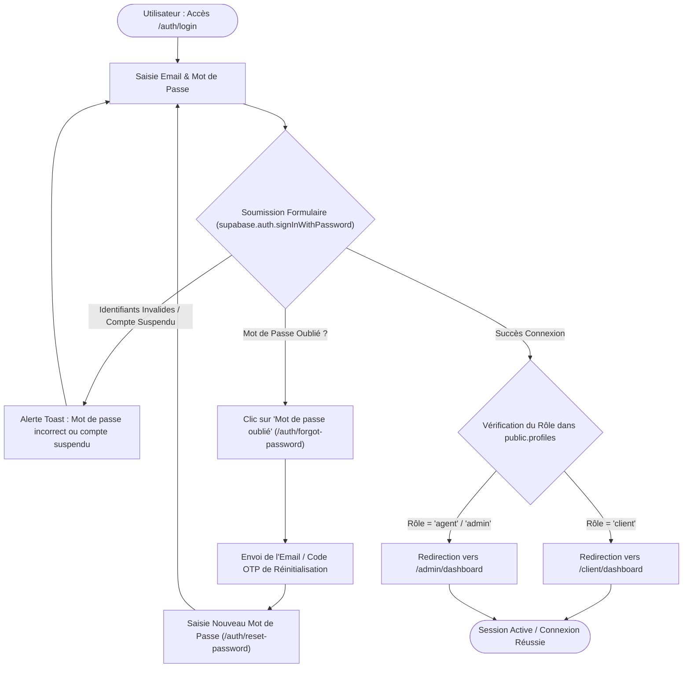

# Procédure de Flux : Connexion, OTP et Réinitialisation de Mot de Passe (FLOW-AUTH-02)

---

## 1. Synthèse Exécutive

* **Famille de Flux** : `01_Onboarding_Auth`
* **Code du Flux** : `FLOW-AUTH-02`
* **Acteurs Principaux** : Client Privé, Agent Commercial, Administrateur System
* **Objectif Fonctionnel** : Authentification par identifiants (email/mot de passe), vérification par code OTP, demande de réinitialisation en cas d'oubli, et déconnexion sécurisée de la session.
* **Préréquis** : Compte existant dans `public.profiles` et `auth.users`.
* **Livrables & État Final** : Session Supabase active, mise à jour des métadonnées de dernière connexion, cookie sécurisé `sb-access-token`.

---

## 2. Matrice d'Habilitation RBAC (Rôles & Permissions)

| Rôle Utilisateur | Niveau d'Accès | Écrans Autorisés après Connexion |
| :--- | :--- | :--- |
| **Client Privé** | `client` | `/client/dashboard`, `/client/profil`, `/client/paiements` |
| **Agent / Manager** | `agent` | `/admin/dashboard`, `/admin/leads`, `/admin/visites` |
| **Administrateur** | `admin` | `/admin/dashboard`, `/admin/kyc`, `/admin/utilisateurs`, `/admin/roles` |
| **Super Admin** | `super_admin` | Accès universel et paramétrage système (`/admin/configuration`) |

---

## 3. Cartographie du Flux (Diagramme Mermaid)

---

## 4. Déroulé Algorithmique Détaillé en Langage Naturel (Du Début à la Fin)

Le flux d'authentification et de réinitialisation de mot de passe est modélisé sous la forme d'un algorithme déterministe sécurisé, articulé en 3 branches principales.

---

### BRANCHE A : Parcours de Connexion Normale

* **Étape A.1 — Accès à l'Écran de Connexion (`/auth/login`)**
  * L'utilisateur (Client, Agent, Admin ou Super Admin) accède à la page `/auth/login`.
  * **Contrôle préalable du serveur** : Le système vérifie si un cookie de session valide existe déjà dans le navigateur (`sb-access-token`).
    * *Si session active* : L'utilisateur est immédiatement redirigé vers son espace dédié (`/client/dashboard` ou `/admin/dashboard`) sans repasser par le formulaire.
    * *Si aucune session* : Le formulaire de connexion est affiché. Les champs sont protégés contre l'auto-remplissage forcé du navigateur (`autoComplete="new-password"`) afin de garantir la confidentialité sur ordinateur partagé.

* **Étape A.2 — Saisie et Validation Locale des Identifiants**
  * L'utilisateur saisit son adresse email et son mot de passe.
  * Le composant frontend valide la forme de l'email (regex d'adresse valide) et s'assure que le mot de passe n'est pas vide avant toute soumission au serveur.

* **Étape A.3 — Authentification Serveur (`Supabase Auth`)**
  * Le formulaire transmet les identifiants chiffrés (TLS/HTTPS) à la Server Action d'authentification.
  * Le serveur appelle `supabase.auth.signInWithPassword({ email, password })`.
  * **Traitement du résultat** :
    * *Échec (Email inconnu ou mot de passe incorrect)* : Le système retourne une alerte Toast avec un message d'erreur neutre (*"Identifiants invalides"*), empêchant l'énumération de comptes par des tiers malveillants. L'utilisateur reste sur la page de connexion.
    * *Succès* : Supabase valide le hash du mot de passe (bcrypt) et génère les jetons de session (Access Token & Refresh Token).

* **Étape A.4 — Contrôle de Sécurité du Profil & Habilitation RBAC (`public.profiles`)**
  * Une fois le jeton validé, le serveur interroge le profil utilisateur lié dans la table `public.profiles`.
  * **Vérification du statut de compte (Soft Delete)** :
    * *Si la colonne `deleted_at` est renseignée* (timestamp non nul) : Le compte est suspendu ou archivé. La session est automatiquement révoquée (`signOut()`), et l'utilisateur est redirigé vers la page d'information `/suspended`.
    * *Si le compte est actif* : La colonne `last_login_at` est mise à jour avec l'horodatage actuel.

* **Étape A.5 — Aiguillage vers l'Espace Dédié & Initialisation PWA**
  * Le système examine le rôle de l'utilisateur (`user.role`) :
    * *Si `role = 'client'`* $\rightarrow$ Redirection vers l'Espace Client Privé (`/client/dashboard`).
    * *Si `role = 'agent'`, `'admin_manager'`, `'admin'` ou `'super_admin'`* $\rightarrow$ Redirection vers la Console d'Administration (`/admin/dashboard`).
  * Les cookies de session sécurisés (`HTTP-Only`, `SameSite=Lax`, `Secure`) sont scellés dans le navigateur.
  * Le Service Worker PWA s'active, enregistre l'abonnement aux notifications Push VAPID et active le récepteur d'alertes sonores.

---

### BRANCHE B : Parcours "Mot de Passe Oublié" & Réinitialisation par Code OTP

* **Étape B.1 — Demande de Réinitialisation (`/auth/forgot-password`)**
  * En cas d'oubli de mot de passe sur la page de connexion, l'utilisateur clique sur *"Mot de passe oublié ?"*.
  * Il est réorienté vers le formulaire `/auth/forgot-password` et saisit son adresse email.

* **Étape B.2 — Génération du Code OTP & Envoi de l'Email**
  * Le serveur reçoit la demande et exécute `supabase.auth.resetPasswordForEmail(email, { redirectTo })`.
  * Un jeton à usage unique (OTP / Lien magique) sécurisé est généré avec une durée de validité stricte de 15 minutes.
  * Un email transactionnel HTML à l'identité visuelle de Favor Company (conçu via `react-email` / Resend) est expédié à l'adresse indiquée.
  * Une alerte de confirmation informe l'utilisateur : *"Un lien de réinitialisation vous a été envoyé par email"*.

* **Étape B.3 — Validation du Lien & Accès à la Saisie du Nouveau Mot de Passe (`/auth/reset-password`)**
  * L'utilisateur ouvre son email et clique sur le bouton sécurisé.
  * Le navigateur est redirigé vers l'écran `/auth/reset-password` en transportant le jeton temporaire en paramètre d'URL.
  * Le système contrôle l'authenticité et la non-expiration du jeton OTP.

* **Étape B.4 — Enregistrement du Nouveau Mot de Passe & Confirmation**
  * L'utilisateur saisit son nouveau mot de passe et le confirme dans le formulaire.
  * **Contrôle de robustesse** : Le mot de passe doit comporter au moins 8 caractères, incluant au moins une majuscule, un chiffre et un caractère spécial.
  * Après validation, le serveur exécute `supabase.auth.updateUser({ password })`.
  * L'ancien mot de passe est écrasé et le jeton OTP est définitivement invalidé.
  * Un toast de succès s'affiche et l'utilisateur est automatiquement réorienté vers la page de connexion (`/auth/login`).

---

### BRANCHE C : Parcours de Déconnexion Sécurisée (Logout)

* **Étape C.1 — Déclenchement de la Déconnexion**
  * L'utilisateur clique sur le bouton *"Se déconnecter"* présent dans le menu profil (composant `NavUser.tsx` ou `ClientHeader.tsx`).

* **Étape C.2 — Destruction des Sessions et Nettoyage**
  * Le composant exécute `supabase.auth.signOut()`.
  * Les cookies de session `sb-access-token` et `sb-refresh-token` sont invalidés et supprimés du navigateur.
  * Les données temporaires enregistrées en mémoire locale (`localStorage`, caches PWA) sont nettoyées.
  * L'utilisateur est immédiatement redirigé vers la page d'accueil publique (`/`).

---

## 5. Synthèse des Contrôles de Sécurité & Résilience

1. **Anti-Enumeration attack** : Les messages d'erreur lors d'un échec de connexion ne révèlent jamais si c'est l'email ou le mot de passe qui est invalide.
2. **Isolation des rôles (RBAC)** : Impossible pour un compte `client` d'accéder aux routes `/admin/*` même s'il connaît l'URL exacte (filtrage automatique par les Server Actions et les composants Layout).
3. **Péremption OTP** : Les liens de réinitialisation expirent après 15 minutes et s'invalident dès leur première utilisation.
4. **Soft Delete Gating** : Tout compte dont la colonne `deleted_at` est non nulle est bloqué à l'authentification.

---

## 6. Résumé Général du Fonctionnement

L’accès aux espaces de la plateforme Favor Company International a été conçu pour offrir une expérience fluide, intuitive et parfaitement rassurante, semblable à l’ouverture de la porte d’une demeure privée. Lorsqu’une personne souhaite se connecter, il lui suffit d’indiquer son adresse électronique ainsi que son mot de passe secret. Le système procède alors instantanément à une vérification attentive pour s'assurer que la clé présentée correspond exactement au compte enregistré. Si les informations saisies sont correctes et que le compte est en règle, les portes de la plateforme s’ouvrent automatiquement et orientent directement l'utilisateur vers son espace personnel : le client retrouve l'historique de ses projets et réservations immobilières, tandis que les membres de l'équipe administrative accèdent à leurs outils de gestion. En revanche, si une erreur de saisie survient ou si un utilisateur ne se souvient plus de son mot de passe, rien n'est laissé au hasard. Un parcours d'aide simple et chaleureux lui permet de demander un secours immédiat : un courrier électronique lui est envoyé avec un lien temporaire sécurisé lui permettant de créer un tout nouveau mot de passe en toute tranquillité. Enfin, dès que l'utilisateur décide d'interrompre sa session et de quitter la plateforme, un simple clic sur le bouton de déconnexion verrouille soigneusement l'accès et referme la porte derrière lui, garantissant ainsi une confidentialité totale et une sécurité sans la moindre faille.
