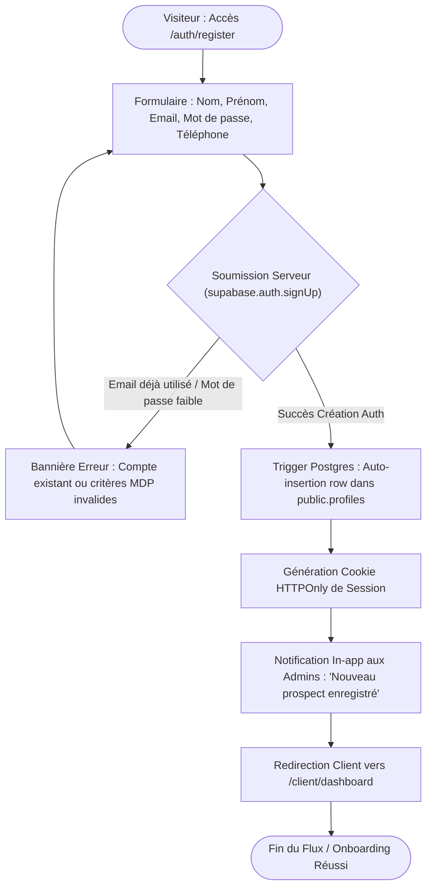

# Procédure de Flux : Inscription et Onboarding Client Privé (FLOW-AUTH-01)

---

## 1. Synthèse Exécutive

* **Famille de Flux** : `01_Onboarding_Auth`
* **Code du Flux** : `FLOW-AUTH-01`
* **Acteur Principal** : Client Privé Acquéreur
* **Objectif Fonctionnel** : Inscription sécurisée d'un nouveau client, création automatisée du profil utilisateur dans Supabase Postgres (`profiles`), vérification d'adresse email et accès à l'Espace Client Privé.
* **Préréquis** : Aucun (Flux d'entrée public).
* **Livrables & État Final** : Compte client actif, jeton JWT de session Supabase valide, cookie de session sécurisé `sb-access-token`, redirection vers `/client/dashboard`.

---

## 2. Matrice d'Habilitation RBAC (Rôles & Permissions)

| Rôle Utilisateur | Permissions DB | Accès Écran |
| :--- | :--- | :--- |
| **Visiteur Anonyme** | `anon` | `/auth/register`, `/auth/login`, `/auth/forgot-password` |
| **Client Privé** | `authenticated` + role=`client` | `/client/dashboard`, `/client/profil`, `/client/paiements` |

---

## 3. Cartographie du Flux (Diagramme Mermaid)

---

## 4. Déroulé Algorithmique Détaillé en Langage Naturel (Du Début à la Fin)

Le flux d'inscription et d'intégration d'un nouveau client est structuré sous la forme d'un algorithme automatisé et hautement sécurisé, articulé en 5 étapes successives.

---

### Étape 1 — Accès au Formulaire d'Inscription (`/auth/register`)
* **Action** : Le futur client accède à la page d'inscription `/auth/register`.
* **Vérification automatique préalable** : Le système contrôle si l'utilisateur possède déjà une session active sur son navigateur.
  * *Si connecté* : Il est automatiquement redirigé vers son espace client (`/client/dashboard`).
  * *Si non connecté* : Le formulaire d'accueil s'affiche avec les champs requis : Nom complet, Adresse email, Numéro de téléphone et Mot de passe.

---

### Étape 2 — Validation Locale et Contrôle de Saisie
* **Action** : L'utilisateur remplit les informations demandées et valide le formulaire.
* **Vérifications en temps réel (Côté Navigateur)** :
  * **Adresse email** : Contrôle du format standard (présence de l'arobase et du domaine).
  * **Numéro de téléphone** : Vérification de la validité du format téléphonique.
  * **Mot de passe** : Vérification des exigences de sécurité (minimum 8 caractères avec au moins une majuscule, un chiffre et un caractère spécial).
  * **Consentement légal** : Case à cocher obligatoire d'acceptation des conditions d'utilisation et de la politique de confidentialité (conformité RGPD & ARTCI).

---

### Étape 3 — Création du Compte & Création Automatique du Profil (`Supabase Auth & Postgres`)
* **Action** : Les données du formulaire sont transmises au serveur de façon chiffrée (HTTPS/TLS).
* **Traitement Serveur & Moteur de Base de Données** :
  * **Vérification de l'unicité** : Le système vérifie si l'adresse email existe déjà.
    * *Si l'email est déjà enregistré* : Une alerte explicite informe l'utilisateur que cet email possède déjà un compte et l'invite à se connecter.
    * *Si l'email est libre* : Le compte est créé de façon sécurisée dans la table système d'authentification (`auth.users`).
  * **Création instantanée du profil client** : Un déclencheur automatique en base de données (*Trigger Postgres*) crée immédiatement la fiche de profil correspondante dans `public.profiles` avec le rôle `client`, associant le nom complet, le téléphone et la date de création.

---

### Étape 4 — Émission de l'Email de Confirmation & Attachement de Session
* **Action** : Le serveur expédie un email de bienvenue et de confirmation d'adresse à l'utilisateur (via le module `react-email` / Resend).
* **Création de la session** :
  * Un jeton de session JWT sécurisé est généré et stocké sous forme de cookie de navigation chiffré (`sb-access-token`, `HTTP-Only`, `SameSite=Lax`).
  * Une notification interne signale aux équipes commerciales l'enregistrement d'un nouveau prospect qualifié.

---

### Étape 5 — Orientation et Première Visite de l'Espace Client Privé (`/client/dashboard`)
* **Action** : L'utilisateur est automatiquement redirigé vers son espace client d'accueil (`/client/dashboard`).
* **Initialisation de l'interface** :
  * La barre de navigation s'anime et initialise la cloche de notifications en temps réel (`NotificationsBell`).
  * Le Service Worker PWA enregistre l'abonnement Push pour les alertes sur smartphone/ordinateur.
  * Le client peut immédiatement consulter le catalogue de biens d'exception, effectuer une réservation ou compléter ses informations d'identité (KYC).

---

## 5. Synthèse des Contrôles de Sécurité & Résilience

1. **Isolation des Rôles (RBAC)** : Tout nouveau compte créé via le formulaire public reçoit obligatoirement et exclusivement le rôle `client` (`user.role = 'client'`), lui interdisant tout accès à la console d'administration.
2. **Double Enregistrement Atomique** : L'utilisation d'un déclencheur automatique Postgres (*Trigger*) garantit qu'aucun compte d'authentification ne peut exister sans sa fiche de profil associée.
3. **Protection contre l'usurpation d'identité** : Vérification stricte de l'unicité de l'email et chiffrement robuste du mot de passe (hachage bcrypt).
4. **Conformité Légale ARTCI & RGPD** : Enregistrement de l'accord explicite de l'utilisateur avant toute création de compte.

---

## 6. Résumé Général du Fonctionnement

Rejoindre la communauté des clients privilégiés de Favor Company International est une démarche pensée pour être à la fois d'une grande simplicité et entourée des plus hautes garanties de protection. Lorsqu'un futur acquéreur souhaite ouvrir son espace personnel, il lui suffit de compléter un court formulaire d'accueil en renseignant son nom, son adresse électronique, son numéro de téléphone et le mot de passe secret qu'il aura choisi. Dès la validation de sa demande, le système vérifie instantanément la clarté et la conformité des informations transmises. Si l'adresse électronique n'a jamais été utilisée sur la plateforme, les portes de l'espace client lui sont ouvertes sans le moindre délai : une fiche personnelle sécurisée est créée spécialement pour lui, et un message d'accueil lui est adressé par courrier électronique pour confirmer son inscription. L'utilisateur se retrouve alors immédiatement transporté au cœur de son espace privé, où il peut explorer en toute sérénité les offres immobilières d'exception, planifier des visites sur le terrain et effectuer ses premières démarches en toute confiance, sous le regard attentif des conseillers de la maison.
