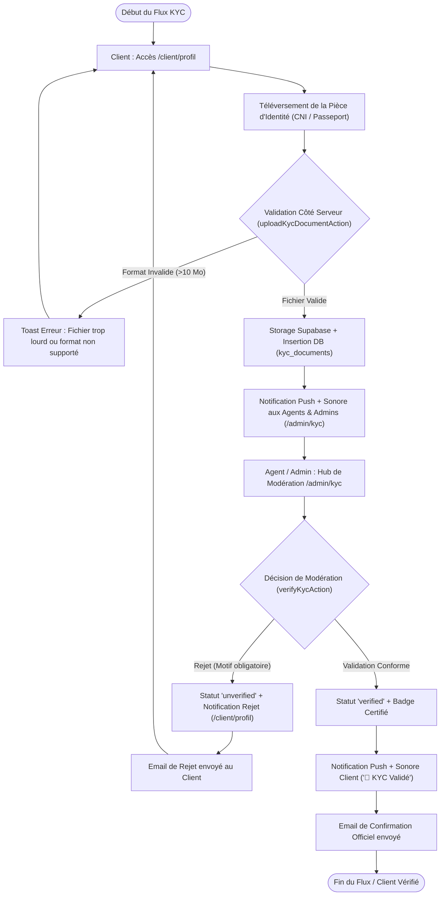

# Procédure de Flux : Vérification KYC et Modération Client (FLOW-KYC-01)

---

## 1. Synthèse Exécutive

* **Famille de Flux** : `02_KYC_Verification`
* **Code du Flux** : `FLOW-KYC-01`
* **Acteurs Principaux** : Client Privé, Agent Commercial / Manager, Administrateur Système
* **Objectif Fonctionnel** : Authentification réglementaire (KYC) des clients acquéreurs conformément aux normes financières et notariales OHADA en Côte d'Ivoire.
* **Préréquis** : Compte client créé et authentifié (session Supabase valide).
* **Livrables & État Final** : Statut du profil certifié `'verified'`, badge de confiance affiché sur l'espace client, habilitation à la signature électronique des contrats fonciers.

---

## 2. Matrice d'Habilitation RBAC (Rôles & Permissions)

| Rôle Utilisateur | Permissions | Actions Autorisées dans ce Flux |
| :--- | :--- | :--- |
| **Client Privé** (`client`) | Écriture / Téléversement | Soumission de la CNI / Passeport, consultation du statut de modération. |
| **Agent / Manager** (`agent`) | Lecture / Modération | Examen des pièces justificatives, validation ou rejet motivé. |
| **Administrateur** (`admin`) | Contrôle / Override | Validation définitive, déblocage des comptes suspendus. |

---

## 3. Cartographie du Flux (Diagramme Mermaid)

---

## 4. Déroulé Algorithmique Détaillé en Langage Naturel (Du Début à la Fin)

Le flux d'authentification KYC et de modération de pièce d'identité est modélisé sous la forme d'un algorithme déterministe articulé en 5 étapes clé.

---

### Étape 1 — Accès à l'Espace Profil Client (`/client/profil`)
* **Action** : Le client connecté accède à son profil personnel et se rend dans la section d'authentification d'identité (KYC).
* **Affichage de l'état** :
  * *Si statut = `'unverified'`* : Le formulaire de téléversement est ouvert avec sélection du type de pièce (Carte Nationale d'Identité, Passeport, Attestation d'Identité ou Titre de Séjour).
  * *Si statut = `'pending'`* : Une bannière informative signale que le dossier est en cours d'examen par l'équipe de modération.
  * *Si statut = `'verified'`* : Le badge officiel certifié est affiché et le formulaire d'upload est verrouillé.

---

### Étape 2 — Validation Locale du Fichier et Téléversement Sécurisé
* **Action** : Le client sélectionne son document (fichier PDF, PNG ou JPG) et soumet le formulaire.
* **Vérifications de sécurité côté serveur (`uploadKycDocumentAction`)** :
  * **Taille du fichier** : Limitation stricte à 10 Mo par document.
  * **Type MIME** : Seuls les formats d'image et PDF valides sont acceptés.
  * **Stockage chiffré** : Le fichier est téléversé dans un bucket de stockage sécurisé Cloud (`kyc-documents/`), isolé par des règles d'accès RLS.
* **Mise à jour en Base de Données** :
  * La colonne `kyc_status` du profil utilisateur passe à `'pending'`.
  * La référence de l'URL chiffrée et la date de soumission sont enregistrées.

---

### Étape 3 — Émission de l'Alerte et Notification au Personnel (`Push & Audio`)
* **Action** : Dès la soumission validée, le système déclenche une alerte temps réel.
* **Canaux de notification** :
  * Une notification Push avec émission d'un signal sonore d'alerte (`/sounds/notification.mp3`) est envoyée aux navigateurs des agents commerciaux et des administrateurs connectés.
  * Une entrée cliquable apparaît dans la console de modération (`/admin/kyc`).

---

### Étape 4 — Examen du Dossier dans le Hub de Modération (`/admin/kyc`)
* **Action** : L'agent commercial ou l'administrateur accède au tableau de bord des vérifications KYC (`KycModerationHub`).
* **Interface d'inspection** :
  * L'agent consulte la prévisualisation haute définition du document d'identité transmis.
  * Il vérifie la concordance du nom complet, de la date de naissance et de la clarté du document avec les informations enregistrées.

---

### Étape 5 — Décision de Modération & Issue du Flux

#### Scénario 5.A : Validation du Document
* L'administrateur clique sur *"Valider la pièce d'identité"*.
* La Server Action `verifyKycAction` passe le statut du profil à `'verified'`.
* **Conséquences** :
  * Le badge vert certifié apparaît instantanément sur l'espace du client.
  * Le client reçoit une notification Push festive ainsi qu'un email de confirmation d'authentification.
  * Le compte est désormais habilité à réserver des biens et à signer électroniquement les contrats d'acquisition.

#### Scénario 5.B : Rejet de la Pièce
* L'administrateur clique sur *"Refuser le document"* et sélectionne un motif obligatoire (ex: *Document flou*, *Pièce expirée*, *Nom discordant*).
* Le statut du profil repasse à `'unverified'` et le motif du refus est consigné dans `kyc_rejection_reason`.
* **Conséquences** :
  * Le client reçoit une notification Push et un email d'explication détaillant la raison exacte du rejet.
  * Le formulaire de soumission sur `/client/profil` s'ouvre de nouveau pour permettre au client de transmettre un document conforme.

---

## 5. Synthèse des Contrôles de Sécurité & Résilience

1. **Isolation RLS des Documents** : Seuls l'utilisateur propriétaire et les administrateurs habilités disposent du droit de lecture sur les pièces d'identité téléversées dans le bucket.
2. **Motif de Rejet Obligatoire** : Impossible pour un agent d'annuler ou de rejeter un dossier sans spécifier un motif clair et pédagogique pour le client.
3. **Double Traçabilité** : Chaque action de modération enregistre l'horodatage exact et l'identifiant de l'agent responsable de la décision.
4. **Attributs d'Habilitation Notariale** : Seul le statut `'verified'` autorise la génération et la signature électronique des conventions de vente et contrats de réservation.

---

## 6. Résumé Général du Fonctionnement

L'authentification de l'identité des acquéreurs, communément appelée démarche d'identification et de vérification d'identité, constitue une garantie essentielle de sérénité et de conformité pour l'ensemble des transactions immobilières prises en charge par Favor Company International. Lorsqu'un client souhaite faire valider son compte, il se rend en toute simplicité dans son profil personnel et y dépose une copie numérique de sa pièce d'identité officielle, qu'il s'agisse d'une carte nationale ou d'un passeport. Dès l'envoi du document, les conseillers et responsables de la maison reçoivent une alerte immédiate les invitant à examiner le dossier. Un agent dédié prend alors le soin de vérifier attentivement la lisibilité et l'authenticité de la pièce soumise. Deux issues sont alors possibles : si le document est jugé parfaitement conforme, le compte du client reçoit aussitôt le sceau de confirmation officielle lui ouvrant le droit d'accéder aux réservations et à la signature des contrats d'acquisition ; en revanche, si la pièce s'avère illisible ou incomplète, l'utilisateur est immédiatement informé du motif précis et bienveillant du refus, et invité à transmettre à nouveau son document en toute sérénité.
