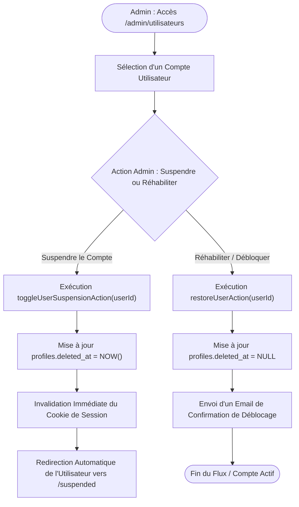

# Procédure de Flux : Suspension et Déblocage de Compte Utilisateur (FLOW-KYC-02)

---

## 1. Synthèse Exécutive

* **Famille de Flux** : `02_KYC_Verification`
* **Code du Flux** : `FLOW-KYC-02`
* **Acteurs Principaux** : Administrateur Système, Super Admin, Client / Agent Suspendu
* **Objectif Fonctionnel** : Suspension administrative temporaire ou définitive d'un utilisateur (fraude, document falsifié, litige) et réhabilitation après régularisation.
* **Préréquis** : Privilèges Administrateur (`admin` ou `super_admin`).
* **Livrables & État Final** : Horodatage `deleted_at` renseigné dans `profiles`, invalider la session active, affichage de la page `/suspended`.

---

## 2. Matrice d'Habilitation RBAC (Rôles & Permissions)

| Rôle Utilisateur | Permissions DB | Actions Autorisées |
| :--- | :--- | :--- |
| **Administrateur** | `admin` | Suspension/Déblocage des comptes `client` et `agent`. |
| **Super Admin** | `super_admin` | Suspension/Déblocage de tous les utilisateurs y compris les admins. |

---

## 3. Cartographie du Flux (Diagramme Mermaid)

---

## 4. Déroulé Algorithmique Détaillé en Langage Naturel (Du Début à la Fin)

Le flux de suspension et de réhabilitation d'un compte utilisateur est modélisé sous la forme d'un algorithme d'administration sécurisé, découpé en 3 étapes et 2 scénarios opérationnels.

---

### Étape 1 — Détection d'Anomalie et Sélection du Compte (`/admin/utilisateurs`)
* **Action** : L'administrateur ou le responsable de la modération identifie un compte nécessitant une intervention (tentative de fraude, document d'identité falsifié, non-respect des règles contractuelles ou demande explicite du client).
* **Accès au panneau d'administration** : L'administrateur ouvre le hub de gestion des utilisateurs (`/admin/utilisateurs`), recherche le compte concerné par son nom, son email ou sa référence client.

---

### Étape 2 — Exécution de l'Action Administrative Ciblée

#### Scénario 2.A : Suspension du Compte (Gel des Accès)
* **Déclenchement** : L'administrateur clique sur *"Suspendre le compte"*.
* **Traitement Serveur (`toggleUserSuspensionAction`)** :
  * Le serveur applique le principe de suppression douce (*Soft Delete*) en renseignant la colonne `deleted_at = NOW()` dans la table `public.profiles`.
  * La session en cours de l'utilisateur est immédiatement révoquée.
  * Les jetons d'accès et cookies de session sont invalidés à l'échelle du serveur.
* **Conséquences pour l'utilisateur** :
  * Si l'utilisateur est actuellement en train de naviguer, sa prochaine action est interceptée et il est immédiatement redirigé vers l'écran d'information `/suspended`.
  * Toute tentative ultérieure de connexion est bloquée avec le message : *"Compte suspendu par l'administration"*.

#### Scénario 2.B : Déblocage & Réhabilitation du Compte
* **Déclenchement** : Après régularisation du dossier ou levée du litige, l'administrateur clique sur *"Réhabiliter le compte"*.
* **Traitement Serveur (`restoreUserAction`)** :
  * La colonne `deleted_at` de la fiche de profil est réinitialisée à `NULL`.
  * Le statut du compte repasse à l'état actif.
* **Conséquences pour l'utilisateur** :
  * Un email officiel de confirmation de réhabilitation est envoyé à l'utilisateur via `react-email` / Resend.
  * L'utilisateur peut à nouveau se connecter normalement avec ses identifiants habituels.

---

### Étape 3 — Notification & Traçabilité des Décisions
* **Action** : Chaque action de suspension ou de réhabilitation est enregistrée dans le journal d'audit administratif.
* **Informations archivées** : Identifiant de l'administrateur responsable, horodatage exact, motif de l'action et ancien/nouveau statut du compte.

---

## 5. Synthèse des Contrôles de Sécurité & Résilience

1. **Conservation des Données (Soft Delete)** : Aucune donnée client n'est définitivement effacée de la base de données lors d'une suspension. L'historique des transactions, paiements et contrats reste intact à des fins juridiques et auditables.
2. **Interception Immédiate par le Middleware** : Le middleware de navigation vérifie systématiquement le champ `deleted_at` à chaque requête de page, empêchant un utilisateur suspendu de continuer à utiliser l'application.
3. **Hiérarchie Stricte des Droits (RBAC)** : Un administrateur standard ne peut pas suspendre un compte `super_admin`. Seul un Super Administrateur dispose des privilèges élevés d'action sur l'ensemble du personnel.

---

## 6. Résumé Général du Fonctionnement

Afin de préserver la sécurité de la plateforme et de protéger l'ensemble des acquéreurs, Favor Company International dispose d'un mécanisme de protection permettant de suspendre temporairement ou de rétablir l'accès à un compte utilisateur. Lorsqu'une irrégularité est constatée, comme l'envoi d'un document non conforme ou un non-respect des engagements, les responsables de l'administration peuvent décider de geler l'accès du compte concerné. Dès cet instant, l'utilisateur ne peut plus naviguer sur ses espaces privés et se voit présenter un écran d'information l'invitant à prendre contact avec les services de la maison. Toutes ses informations et l'historique de ses démarches restent précieusement conservés en toute sécurité. Une fois la situation éclaircie ou le dossier réajusté avec l'équipe support, l'administrateur peut débloquer le compte d'un simple clic. L'utilisateur reçoit alors un courrier électronique l'informant du rétablissement de ses accès, lui permettant de reprendre l'usage de son compte en toute tranquillité.
