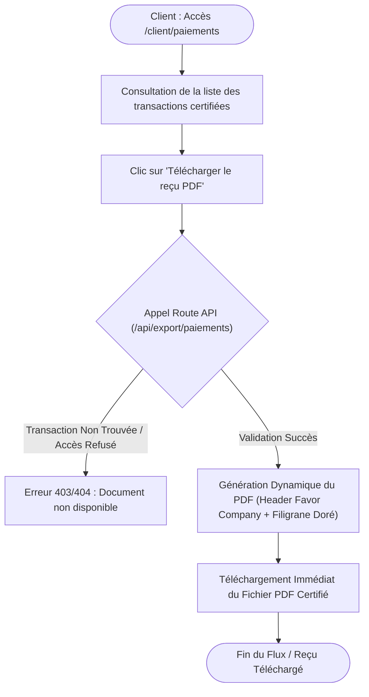

# Procédure de Flux : Émission de Factures et Reçus Certifiés PDF (FLOW-PAY-02)

---

## 1. Synthèse Exécutive

* **Famille de Flux** : `03_Reservations_Paiements`
* **Code du Flux** : `FLOW-PAY-02`
* **Acteurs Principaux** : Client Privé, Service Comptable / Admin
* **Objectif Fonctionnel** : Génération automatique ou à la demande des reçus de paiement certifiés et des factures d'acompte au format PDF avec en-tête officiel du Promoteur Agréé.
* **Préréquis** : Transaction enregistrée avec statut `'COMPLETED'` dans la table `payments`.
* **Livrables & État Final** : Document PDF téléchargeable depuis l'Espace Client (`/client/paiements`) ou l'Espace Admin (`/admin/paiements`).

---

## 2. Matrice d'Habilitation RBAC (Rôles & Permissions)

| Rôle Utilisateur | Accès Document | Actions Autorisées |
| :--- | :--- | :--- |
| **Client Privé** | Ses propres reçus | Téléchargement PDF, impression, consultation depuis son tableau de bord. |
| **Agent / Admin** | Tous les reçus | Export groupé, réémission, transmission notariale. |

---

## 3. Cartographie du Flux (Diagramme Mermaid)

---

## 4. Déroulé Algorithmique Détaillé en Langage Naturel (Du Début à la Fin)

Le flux d'émission, de certification et d'exportation des reçus de paiement et factures d'acompte au format PDF est modélisé sous la forme d'un algorithme automatisé en 4 étapes clés.

---

### Étape 1 — Déclenchement Automatique post-Paiement ou Demande à la Demande (`/client/paiements`)
* **Déclenchement automatique** : Dès qu'une transaction Paystack ou un paiement par acompte est confirmé avec le statut `'COMPLETED'`, le système génère la référence unique du reçu.
* **Accès par le client** : Le client se rend dans la rubrique de suivi financier (`/client/paiements`). L'historique de ses versements s'affiche avec la désignation exacte du bien réservé, le montant réglé en FCFA et un bouton d'action *"Télécharger le reçu PDF"*.

---

### Étape 2 — Contrôle des Permissions & Extraction des Données Comptables
* **Action** : Lors du clic sur le bouton de téléchargement, le navigateur effectue un appel sécurisé vers la Route API `/api/export/paiements`.
* **Vérification d'habilitation (RBAC)** :
  * Le serveur contrôle l'identité de l'utilisateur connecté via sa session. Un client ne peut télécharger que les factures et reçus associés à son propre identifiant.
  * Les administrateurs et membres du service comptable peuvent extraire les reçus de n'importe quelle transaction depuis la console d'administration (`/admin/paiements`).

---

### Étape 3 — Génération Dynamique du Fichier PDF Certifié
* **Action du moteur de génération PDF (`immo-ci` & PDF Engine)** :
  * Le serveur compile les informations de la transaction et applique la charte graphique officielle du Promoteur Immobilier Agréé.
* **Éléments de certification intégrés au PDF** :
  * **En-tête Officiel** : Logo Favor Company International, numéro d'Agrément Promoteur Immobilier et coordonnées du siège social à Abidjan.
  * **Informations de Vente** : Référence unique de paiement Paystack, désignation exacte de la parcelle/lot/villa, identité de l'acquéreur.
  * **Ventilation Comptable & Fiscale** : Montant Hors Taxes (HT), montant de la TVA 18% Côte d'Ivoire, et total toutes taxes comprises (TTC) exprimé en Francs CFA (XOF).
  * **Sécurité & Intégrité** : Empreinte de contrôle numérique, filigrane officiel et QR Code de vérification d'authenticité.

---

### Étape 4 — Transmission, Téléchargement et Archivage
* **Action** : Le fichier PDF est transmis instantanément au navigateur de l'utilisateur sous forme de flux de données sécurisé (*Stream*).
* **Téléchargement** : Le document s'ouvre ou se télécharge immédiatement sur l'appareil du client.
* **Archivage** : Une copie du document certifié est conservée dans l'espace de stockage sécurisé du projet pour consultation ultérieure ou transmission notariale.

---

## 5. Synthèse des Contrôles de Sécurité & Résilience

1. **Conformité Fiscale ivoirienne & OHADA** : Application stricte du taux de TVA légal de 18% en Côte d'Ivoire et mention explicite de la monnaie officielle FCFA (XOF).
2. **Inviolabilité des Reçus** : Les pièces générées sont scellées et ne peuvent faire l'objet d'aucune modification directe une fois la transaction validée.
3. **Protection contre l'Extraction Non Autorisée** : Les routes API de génération vérifient la session à chaque appel pour empêcher la récupération de factures tierces par manipulation d'URL.

---

## 6. Résumé Général du Fonctionnement

Chaque versement effectué sur la plateforme Favor Company International donne lieu à l'émission immédiate d'une preuve de paiement officielle et infalsifiable. Dès qu'un acompte ou un règlement de réservation est validé, le système prépare automatiquement un document comptable complet au format PDF. Le client peut à tout moment consulter l'historique de ses opérations depuis son espace personnel et télécharger son reçu d'un simple clic. Ce document d'exception comporte toutes les garanties légales et fiscales, notamment les références du contrat, le détail du montant réglé en Francs CFA avec la TVA applicable, ainsi que le sceau officiel attestant de notre qualité de Promoteur Immobilier Agréé. Cette clarté totale permet à l'acquéreur de conserver une preuve d'achat parfaitement reconnue pour le suivi de son projet ou la finalisation de son dossier notarié.
