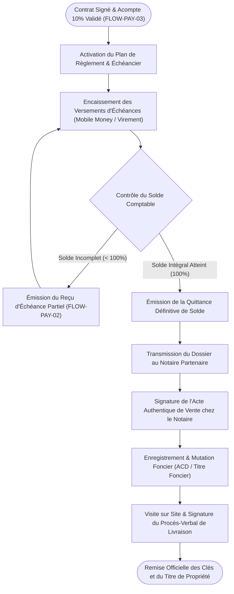

# Procédure de Flux : Suivi des Échéances de Paiement et Livraison Finale des Documents (FLOW-PAY-04)

---

## 1. Synthèse Exécutive

* **Famille de Flux** : `03_Reservations_Paiements`
* **Code du Flux** : `FLOW-PAY-04`
* **Acteurs Principaux** : Client Acquéreur, Service Comptable, Direction Juridique, Notaire Partenaire, Agent Commercial
* **Objectif Fonctionnel** : Suivi de l'échéancier des versements ultérieurs jusqu'à solde intégral (100%), transmission du dossier au notaire, signature de l'acte authentique de vente et remise officielle des documents définitifs de propriété (ACD/Titre Foncier) et des clés.
* **Préréquis** : Contrat physique signé et numérisé dans la plateforme (`FLOW-PAY-03`).
* **Livrables & État Final** : Solde comptable à 100%, reçu de solde définitif, acte notarié signé, procès-verbal de livraison signé et remise des clés / titre foncier à l'acquéreur.

---

## 2. Matrice d'Habilitation RBAC (Rôles & Permissions)

| Rôle Utilisateur | Accès & Permissions | Actions Autorisées |
| :--- | :--- | :--- |
| **Client Acquéreur** | `client` | Suivi du plan de règlement, paiement des échéances, consultation des reçus de solde et de l'avancement du dossier notarié. |
| **Service Comptable** | `admin` | Validation des règlements d'échéances, délivrance des quittances de solde. |
| **Direction Juridique / Notaire** | `admin` / Notaire | Rédaction de l'acte authentique de vente, enregistrement à la conservation foncière (ACD). |
| **Agent Commercial** | `agent` | Organisation du rendez-vous de livraison, signature du PV de livraison sur le terrain et remise des clés. |

---

## 3. Cartographie du Flux (Diagramme Mermaid)

---

## 4. Déroulé Algorithmique Détaillé en Langage Naturel (Du Début à la Fin)

Le flux de suivi des échéances et de livraison finale des documents de propriété est structuré sous la forme d'un algorithme financier et juridique articulé en 5 étapes clés.

---

### Étape 1 — Établissement du Plan de Règlement & Échéancier (Post-Signature Contrat)
* **Action** : Une fois le contrat physique scanné et validé sur la plateforme (`FLOW-PAY-03`), le service financier génère le calendrier des échéances dans l'espace client (`/client/paiements`).
* **Modalités de paiement** :
  * Le solde restant dû (90% du montant total du bien) est ventilé selon l'échéancier convenu (mensualités fixes, appels de fonds selon l'avancement des travaux de construction ou des travaux d'aménagement foncier).

---

### Étape 2 — Encaissement des Échéances Périodiques & Reçus de Versements
* **Paiement par l'acquéreur** : L'acquéreur effectue chaque versement d'échéance par Mobile Money, carte bancaire ou virement bancaire sur le compte officiel de Favor Company International.
* **Traitement comptable** :
  * Chaque versement donne lieu à l'émission immédiate d'un reçu d'échéance certifié PDF (`FLOW-PAY-02`) comportant le montant encaissé et le solde restant à régler.
  * L'avancement de l'échéancier s'actualise en temps réel sur le tableau de bord de l'acquéreur.

---

### Étape 3 — Clôture Financière à 100% & Émission de la Quittance Définitive
* **Action** : Dès réception de l'ultime versement couvrant l'intégralité du prix de vente (100%).
* **Traitement Serveur & Direction Financière** :
  * Le statut financier du dossier bascule à `'solde_integral_paye'`.
  * La direction financière émet la **Quittance Définitive de Solde** scellée sous le tampon officiel de Promoteur Immobilier Agréé.
  * Le dossier est immédiatement transmis à la Direction Juridique pour l'ouverture du volet notarié.

---

### Étape 4 — Formalités Notariales & Enregistrement du Titre Foncier (ACD)
* **Instruction Notariale** :
  * La Direction Juridique transmet le dossier complet (pièces KYC vérifiées, quittance de solde, contrat original signé et pièces techniques du lot) au Notaire Partenaire chargé de la vente.
* **Signature de l'Acte Authentique** :
  * L'acquéreur et le représentant légal de Favor Company International sont convoqués en l'étude notariale pour la signature de l'Acte Authentique de Vente.
* **Conservation Foncière** :
  * Le notaire dépose l'acte auprès des services du Cadastre et de la Conservation Foncière (Ministère de la Construction et de l'Urbanisme) en vue de l'établissement du titre définitif (Arrêté de Concession Définitive - ACD ou Titre Foncier au nom de l'acquéreur).

---

### Étape 5 — Cérémonie Officielle de Remise des Clés & du Titre de Propriété
* **Rendez-vous de livraison sur le terrain** :
  * L'agent commercial attitré et le client acquéreur se rendent sur le site pour effectuer la visite contradictoire de livraison (vérification du bornage pour un terrain nu ou état des lieux pour une villa).
* **Signature du Procès-Verbal de Livraison** :
  * Les deux parties signent le Procès-Verbal (PV) de livraison du bien.
* **Remise Officielle** :
  * L'agent remet physiquement les clés de la propriété (ou le certificat de bornage) ainsi que la copie officielle des actes de propriété certifiés.
  * Le statut final de l'acquisition passe à `'bien_livre'` sur la plateforme.

---

## 5. Synthèse des Contrôles de Sécurité & Résilience

1. **Inviolabilité de la Quittance de Solde** : Aucune démarche notariale de transfert définitif de propriété ne peut être initiée avant la délivrance de la quittance comptable certifiant le paiement intégral (100%) du bien.
2. **Conformité au Droit Immobilier Ivoirien** : Rédaction des actes définitifs devant notaire agréé et immatriculation officielle du titre à la conservation foncière (ACD / Titre Foncier).
3. **PV de Livraison Contradictoire** : La signature physique du PV de livraison sur le terrain garantit l'accord des deux parties sur la conformité du bien remis.

---

## 6. Résumé Général du Fonctionnement

Une fois le contrat d'acquisition signé et l'acompte initial versé, votre projet immobilier entre dans sa phase finale d'échéancier et d'attribution définitive. Vous pouvez suivre en toute sérénité l'évolution de vos versements depuis votre espace personnel, chaque échéance réglée donnant lieu à l'émission immédiate d'un reçu officiel. Dès que l'intégralité du prix de votre bien est soldée, notre direction financière délivre la quittance définitive et transmet l'ensemble de votre dossier à l'étude notariale partenaire. Vous êtes alors invité à signer l'acte authentique de vente devant le notaire, qui se charge des formalités officielles d'enregistrement et d'établissement de votre titre de propriété auprès des services de l'urbanisme. Enfin, une rencontre est organisée sur le terrain avec votre conseiller pour effectuer la visite d'inspection, signer le procès-verbal de livraison et vous remettre solennellement les clés de votre villa ou le certificat de bornage de votre parcelle, marquant ainsi l'aboutissement parfait de votre acquisition en toute quiétude.
