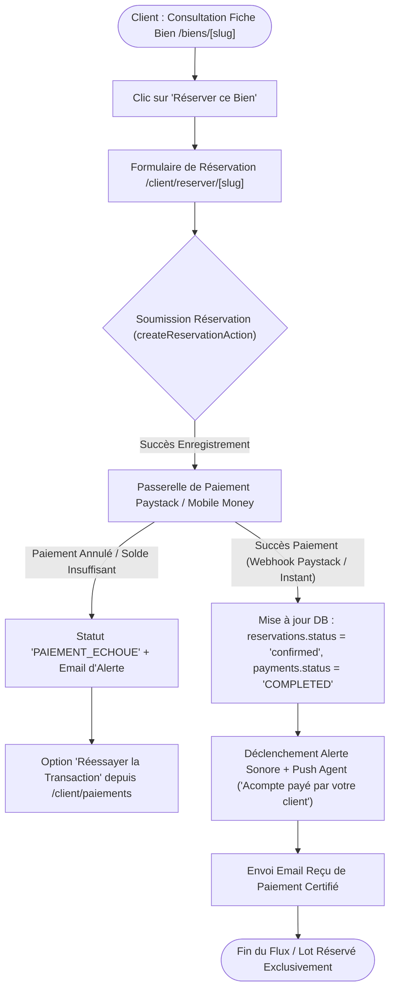

# Procédure de Flux : Réservation Immobilière et Paiement d'Acompte (FLOW-PAY-01)

---

## 1. Synthèse Exécutive

* **Famille de Flux** : `03_Reservations_Paiements`
* **Code du Flux** : `FLOW-PAY-01`
* **Acteurs Principaux** : Client Privé, Service Financier / Admin, Passerelle Paystack / Mobile Money
* **Objectif Fonctionnel** : Réservation exclusive d'une parcelle/bien avec règlement en ligne de l'acompte (Paystack / Orange Money / Wave / MTN / Visa), émission du reçu certifié et notification de l'agent.
* **Préréquis** : Compte client authentifié, dossier KYC vérifié.
* **Livrables & État Final** : Entrée dans `reservations` (`status = 'confirmed'`), enregistrement du paiement (`payments`), facture PDF générée, notification Push + Email transmise.

---

## 2. Matrice d'Habilitation RBAC (Rôles & Permissions)

| Rôle Utilisateur | Permissions | Actions Autorisées |
| :--- | :--- | :--- |
| **Client Privé** | `client` | Réservation d'un lot, règlement de l'acompte via Paystack, téléchargement des reçus. |
| **Agent Attitré** | `agent` | Réception de l'alerte sonore, suivi du dossier client, accompagnement. |
| **Admin / Finance** | `admin` | Validation manuelle des virement bancaires, clôture des contrats. |

---

## 3. Cartographie du Flux (Diagramme Mermaid)

---

## 4. Déroulé Algorithmique Détaillé en Langage Naturel (Du Début à la Fin)

Le flux de réservation immobilière et de paiement en ligne de l'acompte est modélisé sous la forme d'un algorithme financier automatisé et hautement sécurisé, découpé en 5 étapes clé.

---

### Étape 1 — Sélection du Bien & Déclenchement de la Réservation (`/biens/[slug]`)
* **Action** : Le client connecté parcourt le catalogue de biens d'exception et sélectionne la parcelle ou le logement de son choix.
* **Initiation** : En cliquant sur le bouton *"Réserver ce Bien"*, le client ouvre le formulaire de réservation (`/client/reserver/[slug]`).
* **Vérification de disponibilité** : Le système s'assure en temps réel que le lot sélectionné n'est pas déjà réservé ou vendu par un autre client.

---

### Étape 2 — Validation du Formulaire & Pré-Enregistrement (`createReservationAction`)
* **Action** : Le client confirme ses informations personnelles et valide l'option de réservation.
* **Traitement Serveur** :
  * Le serveur crée une entrée temporaire dans la table `reservations` avec le statut `'pending'`.
  * La référence financière unique de la transaction est générée.
  * L'administrateur reçoit une notification in-app d'intention de réservation.

---

### Étape 3 — Orientation vers la Passerelle Sécurisée Paystack
* **Action** : Le client est automatiquement réorienté vers l'interface de paiement sécurisée Paystack.
* **Modes de règlement acceptés** :
  * Mobile Money (Orange Money, Wave, MTN Mobile Money).
  * Cartes bancaires internationales et locales (Visa, Mastercard).
* **Sécurité de la transaction** : Les données bancaires sont traitées directement par la passerelle agréée sans transiter en clair par les serveurs de l'application.

---

### Étape 4 — Traitement de l'Issue du Paiement

#### Scénario 4.A : Succès du Règlement (Confirmation Automatique)
* La passerelle transmet une confirmation instantanée au serveur via un appel sécurisé (*Webhook Paystack avec vérification de signature cryptographique*).
* **Mises à jour atomiques en Base de Données** :
  * Le statut de la réservation passe à `'confirmed'` (`acompte_paye`).
  * La ligne de paiement dans `payments` bascule au statut `'COMPLETED'`.
  * Le lot est marqué comme réservé en exclusivité, empêchant toute double réservation.
* **Notifications immédiates** :
  * L'agent commercial responsable du dossier reçoit une notification Push associée à un signal sonore d'alerte (`/sounds/notification.mp3`).
  * Un email de confirmation contenant le reçu officiel certifié au format PDF est expédié au client.

#### Scénario 4.B : Échec ou Annulation du Paiement
* En cas de solde insuffisant ou de fermeture intempestive de la fenêtre de paiement, la réservation bascule au statut `'PAIEMENT_ECHOUE'`.
* Le client conserve la possibilité de cliquer sur *"Réessayer la transaction"* depuis son espace de paiement (`/client/paiements`).
* Si aucun paiement n'est finalisé dans un délai imparti, le lot est automatiquement remis en disponibilité au catalogue.

---

### Étape 5 — Confirmation et Accès aux Reçus (`/client/paiements`)
* **Action** : Le client est redirigé vers sa page de confirmation d'acompte.
* **Conséquences** :
  * Son reçu officiel d'acompte certifié avec filigrane du Promoteur Immobilier Agréé est téléchargeable immédiatement.
  * Le dossier est transmis à l'agent commercial pour l'organisation de la signature manuscrite du contrat officiel.

---

## 5. Synthèse des Contrôles de Sécurité & Résilience

1. **Double Validation du Webhook** : La confirmation de paiement ne repose pas uniquement sur la redirection navigateur du client, mais fait l'objet d'une vérification directe de serveur à serveur signée cryptographiquement (HMAC-SHA512).
2. **Protection contre la Double Réservation** : Verrouillage atomique des transactions Postgres pour empêcher que deux utilisateurs ne règlent simultanément un acompte sur la même parcelle.
3. **Double Sonnerie & Réactivité Commerciale** : Alerte sonore instantanée (`notification.mp3`) émise sur les écrans des agents pour garantir un accompagnement du client dans les minutes suivant le versement.

---

## 6. Résumé Général du Fonctionnement

La réservation d'un bien immobilier auprès de Favor Company International est une expérience moderne, fluide et d'une sécurité absolue. Lorsqu'un acquéreur coup de cœur choisit une parcelle ou un logement sur le portail, il peut en garantir l'exclusivité en versant son acompte de réservation en ligne. Pour ce faire, il sélectionne en toute simplicité son moyen de paiement préféré, qu'il s'agisse de son compte Mobile Money ou de sa carte bancaire. Dès que le versement de l'acompte est validé par l'établissement financier, le système verrouille immédiatement le bien à son nom pour empêcher toute autre demande. L'acquéreur reçoit aussitôt son reçu d'acompte officiel par courrier électronique et peut le télécharger depuis son espace personnel. Dans le même instant, le conseiller commercial en charge du dossier est averti par un signal sonore et prend contact avec l'acquéreur pour préparer sereinement les étapes suivantes de son projet immobilier.
