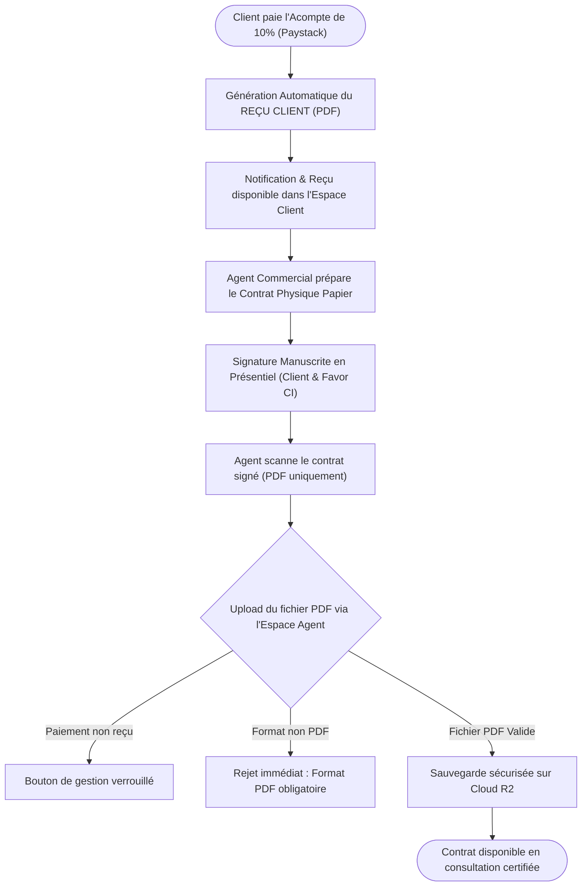

# Procédure de Flux : Gestion des Reçus et Transmission des Contrats (FLOW-PAY-03)

---

## 1. Principes Directeurs & Statut d'Élite

* **Famille de Flux** : `03_Reservations_Paiements`
* **Code du Flux** : `FLOW-PAY-03`
* **Acteurs Principaux** : Client Privé, Agent Commercial, Administrateur Système
* **Objectif Fonctionnel** : Délivrance automatique des reçus d'acompte, signature manuscrite en présentiel et archivage numérisé au format PDF des contrats d'acquisition immobilière.
* **Préréquis** : Acompte de réservation (10%) validé via Paystack (`status = 'COMPLETED'`).
* **Livrables & État Final** : Reçu d'acompte client disponible, contrat physique signé scanné au format PDF (`.pdf`) et archivé en haute sécurité.

---

## 2. Matrice d'Habilitation RBAC (Rôles & Permissions)

| Rôle Utilisateur | Accès Reçus & Contrats | Actions Autorisées |
| :--- | :--- | :--- |
| **Client Privé** | Lecture de ses documents | Téléchargement du reçu et consultation du contrat scanné certifié. |
| **Agent Commercial** | Gestion de son portefeuille | Téléchargement du reçu, téléversement du contrat scanné (`.pdf` uniquement). |
| **Administrateur** | Contrôle universel | Validation définitive, vérification des pièces et déblocage en cas d'erreur. |

---

## 3. Cartographie du Flux (Diagramme Mermaid)

---

## 4. Déroulé Algorithmique Détaillé en Langage Naturel (Du Début à la Fin)

Le flux de gestion des reçus d'acompte et de signature manuscrite des contrats d'acquisition est structuré sous la forme d'un algorithme déterministe articulé en 4 étapes opérationnelles.

---

### Étape 1 — Génération et Délivrance du Reçu d'Acompte
* **Action** : Dès que l'acompte de réservation de 10% est validé avec succès par la passerelle de paiement (Paystack), le système déclenche automatiquement l'émission du reçu.
* **Traitement Serveur** :
  * Le reçu officiel d'acompte est généré au format PDF avec l'en-tête du Promoteur Immobilier Agréé.
  * Le statut de la réservation passe à `acompte_paye`.
  * Le reçu est instantanément mis à disposition sur l'Espace Client (`/client/paiements`) et une notification Push/Email est transmise.

---

### Étape 2 — Préparation du Contrat Physique & Signature Manuscrite
* **Condition d'accès Agent** : Tant que le paiement de l'acompte n'est pas effectif, l'accès au dossier et le bouton de gestion du contrat restent strictement verrouillés pour l'agent.
* **Rencontre en présentiel** : Une fois l'acompte validé, l'agent commercial attitré prépare le contrat officiel papier, convenant d'un rendez-vous avec l'acquéreur.
* **Signature manuscrite** : Le contrat d'acquisition est signé à la main par le client et le représentant légal de Favor Company International.

---

### Étape 3 — Numérisation et Téléversement du Contrat Scanné (PDF Uniquement)
* **Action de l'Agent** : L'agent commercial scanne le document physique signé et accède à l'Espace Administration (`/admin/visites` ou `/admin/leads`).
* **Téléversement sécurisé (`UploadContratModal`)** :
  * L'agent sélectionne le fichier numérisé sur son appareil.
  * **Contrôle strict de format** : Le système exige impérativement un fichier au format PDF (`.pdf`). Tout essai de téléversement d'une image (JPG/PNG) ou d'un fichier traitement de texte (DOCX) est immédiatement bloqué avec le message : *"Seuls les fichiers au format PDF (.pdf) sont acceptés"*.
  * Après validation, le fichier est transféré et stocké dans le bucket de haute sécurité Cloud.

---

### Étape 4 — Consultation, Scellement et Archivage Certifié
* **Traitement système** :
  * Le lien sécurisé du contrat scanné (`contrat_scanne_url`) est scellé dans le profil de réservation du client.
  * Le statut du contrat passe à `uploade_par_agent`.
* **Consultation** : Le bouton *"Consulter le Contrat Actuel"* s'active automatiquement sur les espaces du client et de l'agent, leur permettant de visualiser le document PDF en haute résolution à tout moment.

---

## 5. Synthèse des Contrôles de Sécurité & Résilience

1. **Sécurité Juridique de la Signature Manuscrite** : Pour garantir une valeur probante incontestable devant les juridictions locales et notariales en Côte d'Ivoire, les contrats sont signés à la main avant d'être numérisés.
2. **Gating Strict par Paiement** : Impossible pour un agent d'importer un contrat scanné si l'acompte initial n'a pas été encaissé.
3. **Contrôle de Format PDF Strict** : Rejet automatique de tout format non vectorisé ou modifiable pour empêcher la falsification post-signature.
4. **Règle des 10% d'Acompte** : En cas d'annulation ultérieure par l'acquéreur, l'acompte initial de 10% est conservé par Favor Company International au titre d'indemnité d’immobilisation du foncier et de frais de dossier.

---

## 6. Résumé Général du Fonctionnement

Afin d'offrir une sécurité juridique absolue et une clarté totale à chaque projet d'acquisition, Favor Company International associe la rapidité des paiements numériques à la solennité des signatures manuscrites. Dès qu'un acquéreur valide son acompte de réservation par paiement électronique, le système génère immédiatement son reçu officiel d'acompte, accessible à tout moment dans son espace personnel. Dans le même temps, son conseiller commercial prépare le contrat officiel sous forme papier. Les deux parties se rencontrent alors en présentiel pour procéder à la signature manuscrite du document. Une fois cette formalité accomplie, l'agent scanne le contrat signé et l'enregistre en toute sécurité sur la plateforme au format PDF. Le document certifié devient instantanément consultable par l'acquéreur depuis son espace privé, garantissant ainsi un archivage infalsifiable et une parfaite tranquillité d'esprit jusqu'à la remise des clés et la régularisation notariale.
