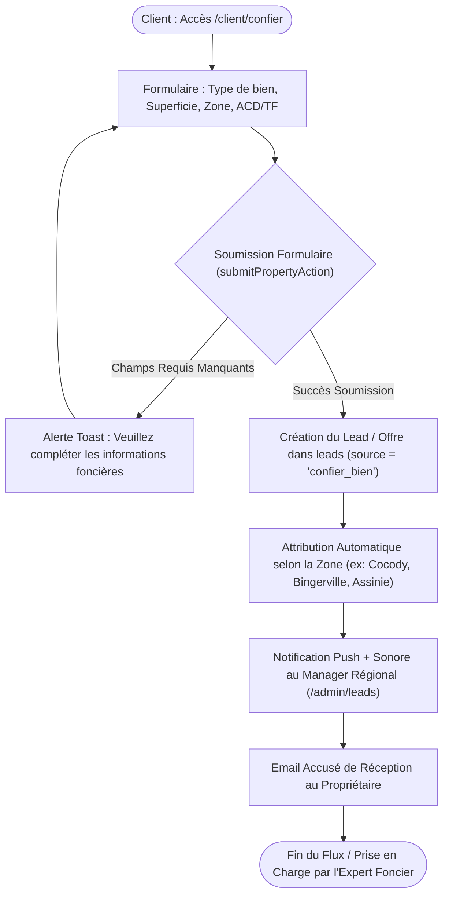

# Procédure de Flux : Soumission "Confier un Bien" et Publication (FLOW-PROP-01)

---

## 1. Synthèse Exécutive

* **Famille de Flux** : `04_Gestion_Biens_Offres`
* **Code du Flux** : `FLOW-PROP-01`
* **Acteur Principal** : Propriétaire Foncier / Client Acquéreur, Responsable d'Agence / Manager
* **Objectif Fonctionnel** : Prise en charge d'un bien/terrain soumis par un particulier ("Confier un Bien"), étude de faisabilité topographique et légale, qualification du prospect, publication dans le catalogue officiel.
* **Préréquis** : Formulaire accessible depuis l'Espace Client ou le site public.
* **Livrables & État Final** : Entrée enregistrée dans `leads` / `properties`, prospect attribué à un responsable d'agence régionale, étude topographique initiée.

---

## 2. Matrice d'Habilitation RBAC (Rôles & Permissions)

| Rôle Utilisateur | Accès | Autorisances |
| :--- | :--- | :--- |
| **Client / Propriétaire** | `client` | Renseignement du type de bien, superficie, localisation, documents de propriété. |
| **Manager d'Agence** | `agent` | Prise de contact, visite sur site, étude de titre foncier (ACD / Arrêté). |
| **Super Admin** | `admin` | Validation de l'aménagement foncier et mise en ligne au catalogue. |

---

## 3. Cartographie du Flux (Diagramme Mermaid)

---

## 4. Déroulé Algorithmique Détaillé en Langage Naturel (Du Début à la Fin)

Le flux de prise en charge, d'étude et de publication d'un bien ou parcelle foncière soumis par un particulier (*"Confier un bien"*) est modélisé sous la forme d'un algorithme d'ingénierie foncière découpé en 4 étapes opérationnelles.

---

### Étape 1 — Renseignement de la Fiche Foncier (`/client/confier`)
* **Action** : Le propriétaire foncier ou l'apporteur d'affaires accède au formulaire *"Confier un Bien"* depuis son espace client ou le portail public.
* **Saisie des informations clé** :
  * Type de bien (Parcelle nue, Lotissement, Villa, Immeuble).
  * Localisation exacte (Ville, Commune, Quartier/Secteur).
  * Superficie totale exprimée en mètres carrés ou hectares.
  * Statut juridique et titre foncier (Arrêté de Concession Définitive - ACD, Titre Foncier, Certificat Foncier ou Attestation Villageoise).
  * Pièces jointes : Photos du site, plan de situation topographique, copies des actes juridiques.

---

### Étape 2 — Validation et Routage Automatique (`submitPropertyAction`)
* **Action** : Le propriétaire valide la soumission de son dossier.
* **Traitement Serveur & Algorithme de Routage** :
  * Le système contrôle l'intégralité des informations saisies.
  * Une entrée d'opportunité (*Lead qualifié*) est enregistrée en base de données avec la source `'confier_bien'`.
  * Le dossier est automatiquement affecté au Manager Régional ou à l'Expert Foncier en charge du secteur géographique indiqué (ex: Abidjan Est, Bingerville, Grand-Bassam, Assinie).

---

### Étape 3 — Notification Immédiate & Accusé de Réception
* **Notification au Personnel** :
  * Le Manager Régional concerné reçoit une notification Push prioritaire accompagnée d'un signal sonore d'alerte (`/sounds/notification.mp3`) sur sa console d'administration (`/admin/leads`).
* **Notification au Propriétaire** :
  * Un email officiel d'accusé de réception (conçu via `react-email` / Resend) est adressé au propriétaire avec son numéro de suivi de dossier unique.

---

### Étape 4 — Expertise Technique sur le Terrain & Qualification Administrative
* **Action de l'Expert Foncier** :
  * Le responsable régional consulte le dossier dans le hub d'administration (`/admin/leads`).
  * Il entre en contact avec le propriétaire pour convenir d'une visite de reconnaissance sur le terrain.
* **Études préalables de promotion immobilière** :
  * Vérification du titre foncier auprès du Ministère de la Construction et de l'Urbanisme.
  * Réalisation de l'étude de faisabilité topographique et d'aménagement par le pôle d'ingénierie de Favor Company International.
  * Après validation du comité d'aménagement, le mandat de vente ou de promotion est signé et le bien est publié dans le catalogue officiel du Promoteur Immobilier Agréé.

---

## 5. Synthèse des Contrôles de Sécurité & Résilience

1. **Vérification Légale du Titre Foncier** : Aucun bien soumis ne peut être publié sur le catalogue officiel sans contrôle préalable et validation de la régularité des documents fonciers (ACD / Titre Foncier).
2. **Routage Régional Automatisé** : L'attribution automatique basée sur la commune élimine les retards de prise en charge et garantit qu'un expert local traite le dossier.
3. **Protection des Données Propriétaires** : Les documents de propriété confidentiels (titres, CNI) sont conservés dans un bucket cloud sécurisé accessible uniquement au personnel habilité.

---

## 6. Résumé Général du Fonctionnement

Favor Company International met son savoir-faire de Promoteur Immobilier Agréé au service des propriétaires fonciers souhaitant valoriser, aménager ou vendre leur terrain ou bâtiment. Grâce au parcours « Confier un Bien », un propriétaire peut transmettre en quelques instants les caractéristiques de son patrimoine, notamment sa localisation, sa superficie ainsi que les documents officiels dont il dispose. Dès l'envoi de la demande, le système identifie le secteur géographique du bien et attribue automatiquement le dossier au responsable régional de la zone. Ce dernier est averti par un signal sonore et prend immédiatement contact avec le propriétaire pour planifier une visite sur le terrain et étudier la faisabilité du projet. Après vérification rigoureuse des titres fonciers auprès des services de l'urbanisme et validation par le pôle d'ingénierie, le bien est prêt à être aménagé ou présenté au catalogue officiel de la maison, offrant ainsi au propriétaire la certitude d'une transaction transparente et sécurisée.
