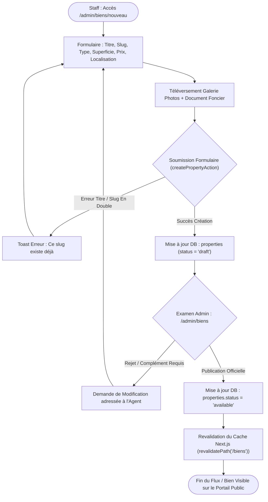

# Procédure de Flux : Modération, Édition et Publication du Catalogue (FLOW-PROP-02)

---

## 1. Synthèse Exécutive

* **Famille de Flux** : `04_Gestion_Biens_Offres`
* **Code du Flux** : `FLOW-PROP-02`
* **Acteurs Principaux** : Responsable Catalogue, Agent Commercial, Administrateur Système
* **Objectif Fonctionnel** : Création d'une nouvelle fiche bien/lotissement, téléversement de galeries photos haute résolution, mise à jour des prix/superficies et publication sur le portail public (`/biens`).
* **Préréquis** : Privilèges Staff (`agent` ou `admin`).
* **Livrables & État Final** : Entrée dans `properties` (`status = 'available'`), slug réécrit et optimisé SEO, fiche accessible sur `/biens/[slug]`.

---

## 2. Matrice d'Habilitation RBAC (Rôles & Permissions)

| Rôle Utilisateur | Permissions | Actions Autorisées |
| :--- | :--- | :--- |
| **Agent Commercial** | `agent` | Création de brouillon, téléversement de photos, édition des détails. |
| **Administrateur** | `admin` | Validation finale de la fiche, mise en ligne, dépublication, suppression. |

---

## 3. Cartographie du Flux (Diagramme Mermaid)

---

## 4. Déroulé Algorithmique Détaillé en Langage Naturel (Du Début à la Fin)

Le flux de création, de modération et de mise en ligne des biens fonciers et immobiliers sur le catalogue public est modélisé sous la forme d'un algorithme déterministe articulé en 5 étapes clé.

---

### Étape 1 — Création de la Fiche et Saisie des Attributs (`/admin/biens/nouveau`)
* **Action** : L'agent commercial ou le responsable catalogue accède à la console de création (`/admin/biens/nouveau`).
* **Saisie des attributs fonciers & immobiliers** :
  * Titre du bien et identifiant URL unique (*Slug optimisé SEO*).
  * Catégorie (Terrain/Lotissement, Villa d'exception, Immeuble, Appartement).
  * Caractéristiques financières : Prix de vente en Francs CFA (XOF), montant de l'acompte (10%).
  * Caractéristiques techniques : Superficie (m² ou hectares), viabilisation (eau, électricité, voirie), titre foncier (ACD / Titre Foncier).
  * Géolocalisation : Commune, quartier et coordonnées GPS.

---

### Étape 2 — Importation et Optimisation des Médias
* **Action** : Téléversement de la galerie photographique et des documents de présentation.
* **Traitement des images** :
  * Les photos haute définition sont téléversées et hébergées sur le réseau de stockage Cloud.
  * Les images sont automatiquement compressées et converties au format WebP pour garantir des temps de chargement ultra-rapides.
  * Définition de l'image de couverture principale qui figurera dans le carrousel du catalogue.

---

### Étape 3 — Enregistrement au Statut Brouillon (`status = 'draft'`)
* **Action** : L'agent soumet la fiche de présentation.
* **Traitement Serveur (`createPropertyAction`)** :
  * Le système contrôle l'unicité du slug et la validité des champs avec Zod.
  * La fiche est enregistrée en base de données au statut temporaire `'draft'` (Brouillon).
  * La fiche n'est pas encore visible sur le site public et attend sa revue de modération.

---

### Étape 4 — Modération et Révision Administrative (`/admin/biens`)
* **Action** : L'administrateur système ou le directeur commercial examine la fiche en attente.
* **Contrôles de modération** :
  * Vérification de la conformité légale des informations affichées.
  * Contrôle de l'esthétique et de la qualité des visuels.
* **Issues de modération** :
  * *Si ajustements requis* : L'administrateur renvoie la fiche à l'agent avec une note explicative d'édition.
  * *Si conforme* : L'administrateur clique sur *"Publier officiellement"*.

---

### Étape 5 — Publication Officielle & Revalidation du Cache (`status = 'available'`)
* **Traitement Serveur (`publishPropertyAction`)** :
  * Le statut du bien bascule à `'available'` (Disponible).
  * Le moteur de rendu révalide le cache du serveur (`revalidatePath('/biens')`), rendant le bien instantanément visible sur la page catalogue publique (`/biens`), le carrousel de la page d'accueil et les moteurs de recherche.
  * Le bien est immédiatement ouvert aux demandes de visite et aux réservations d'acompte en ligne.

---

## 5. Synthèse des Contrôles de Sécurité & Résilience

1. **Double Niveau de Validation (Draft gating)** : Aucune fiche créée par un agent ne peut apparaître sur le site public sans la validation explicite d'un administrateur (`admin`).
2. **Revalidation de Cache Instantanée** : L'utilisation de `revalidatePath` garantit que les modifications de prix ou de statut (ex: passage au statut *Réservé*) sont répercutées sans délai pour tous les visiteurs.
3. **Contrôle d'Unicité du Slug SEO** : Impossibilité de créer deux fiches avec la même URL d'accès, prévenant les erreurs de routage et les conflits de référencement.

---

## 6. Résumé Général du Fonctionnement

Chaque terrain, villa ou projet immobilier présenté sur le portail public de Favor Company International fait l'objet d'un processus rigoureux de création et de modération avant sa mise en ligne. Dans un premier temps, un conseiller commercial prépare minutieusement la fiche du bien en y renseignant sa localisation, sa superficie, son prix en Francs CFA ainsi que les photos en haute définition du site. Une fois cette première mouture enregistrée, la fiche reste confidentielle et passe entre les mains d'un responsable de l'administration. Ce dernier vérifie avec soin l'exactitude des informations et la qualité des visuels. Dès que le dossier est validé, l'administrateur autorise sa publication officielle : le bien apparaît alors instantanément dans le catalogue en ligne de la maison, devenant immédiatement accessible aux acquéreurs du monde entier pour consultation et réservation en toute confiance.
