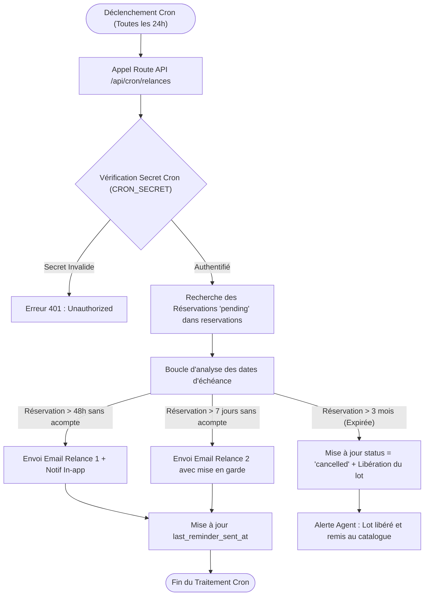

# Procédure de Flux : Relances Automatiques et Tâches Arrière-plan Cron (FLOW-NOTIF-02)

---

## 1. Synthèse Exécutive

* **Famille de Flux** : `05_Notifications_Relances`
* **Code du Flux** : `FLOW-NOTIF-02`
* **Acteurs Principaux** : Système Automatisé (Cron Server), Client Privé Acquéreur, Agent Commercial
* **Objectif Fonctionnel** : Exécution périodique des relances pour les réservations en attente d'acompte (relance à 48h, 7 jours, et notification d'expiration à 3 mois).
* **Préréquis** : Endpoint d'API sécurisé `/api/cron/relances` déclenché par un planificateur (Cron job).
* **Livrables & État Final** : Emails de relance transmis, enregistrement des dates de relance, mise à jour du statut des réservations expirées à `'cancelled'`.

---

## 2. Matrice d'Habilitation RBAC (Rôles & Permissions)

| Rôle Utilisateur | Permissions | Actions Autorisées |
| :--- | :--- | :--- |
| **Système Automatisé** | `cron_secret` | Balayage des tables, envoi automatique d'emails, annulation des réservations expirées. |
| **Agent Commercial** | `agent` | Consultation de l'historique des relances et accompagnement personnalisé du client. |
| **Client Privé** | `client` | Réception des emails de relance et finalisation du versement d'acompte en ligne. |

---

## 3. Cartographie du Flux (Diagramme Mermaid)

---

## 4. Déroulé Algorithmique Détaillé en Langage Naturel (Du Début à la Fin)

Le flux de relance automatisée et de gestion de l'expiration des réservations est modélisé sous la forme d'un algorithme d’arrière-plan déterministe articulé en 5 étapes clés.

---

### Étape 1 — Déclenchement Périodique & Sécurisation de la Route (`/api/cron/relances`)
* **Action** : Toutes les 24 heures (à heure fixe), le planificateur automatique (*Cron Server*) effectue une requête HTTP POST vers l'API `/api/cron/relances`.
* **Vérification d'authentification serveur** :
  * Le serveur contrôle l'en-tête de sécurité `Authorization: Bearer <CRON_SECRET>`.
  * *Si la clé secret est absente ou invalide* : L'accès est rejeté immédiatement avec une erreur `401 Unauthorized`.
  * *Si l'authentification est valide* : Le traitement d'arrière-plan démarre.

---

### Étape 2 — Balayage et Analyse des Réservations en Attente
* **Action** : Le serveur interroge la table `reservations` pour extraire l'ensemble des dossiers au statut temporaire `'pending'` ou `'acompte_en_attente'`.
* **Calcul des délais d'ancienneté** : Pour chaque dossier extrait, le système calcule l'intervalle entre la date actuelle et la date de création de la réservation (`created_at`).

---

### Étape 3 — Exécution des Scénarios de Relances Périodiques

#### Scénario 3.A : Première Relance à 48 Heures (Rappel Amiable)
* **Condition** : La réservation a dépassé 48 heures sans confirmation d'acompte et aucune relance n'a été émise.
* **Actions** :
  * Un email courtois est expédié au client (via `react-email` / Resend) pour lui rappeler de finaliser son versement d'acompte.
  * Une notification in-app apparaît sur son Espace Client (`/client/paiements`).
  * L'horodatage `last_reminder_sent_at` est mis à jour en base de données.

#### Scénario 3.B : Seconde Relance à 7 Jours (Mise en Garde)
* **Condition** : La réservation atteint 7 jours consécutifs sans versement.
* **Actions** :
  * Un email d'avertissement formel informe le client de l'imminence de la perte de son option sur le bien s'il ne finalise pas son paiement.
  * L'agent commercial attitré reçoit une alerte in-app l'invitant à contacter directement le client.

---

### Étape 4 — Gestion de l'Expiration Automatique à 3 Mois (Libération du Bien)
* **Condition** : Une réservation au statut `'pending'` dépasse le délai maximal de 3 mois sans confirmation financière.
* **Actions système automatisées** :
  * Le statut de la réservation passe définitivement à `'cancelled'` (Annulée par expiration).
  * La parcelle ou le logement associé est immédiatement libéré dans la table `properties` et son statut repasse à `'available'`.
  * Le bien est de nouveau rendu visible et disponible à la réservation sur le catalogue public (`/biens`).

---

### Étape 5 — Rapport de Traitement & Clôture du Job
* **Notification au Personnel** :
  * L'agent responsable du dossier est notifié par alerte in-app de l'annulation et de la remise en vente du lot.
* **Réponse de l'API** :
  * L'endpoint récapitule le nombre de relances effectuées et d'annulations opérées, puis clôture proprement la tâche d'arrière-plan.

---

## 5. Synthèse des Contrôles de Sécurité & Résilience

1. **Authentification Stricte par Clé Secrète (`CRON_SECRET`)** : Empêche tout utilisateur ou robot malveillant de déclencher manuellement le script de relance à l'insu de l'administration.
2. **Idempotence & Anti-Spam** : Le suivi du champ `last_reminder_sent_at` garantit qu'un client ne recevra jamais deux fois la même relance lors du même cycle.
3. **Libération Automatique du Foncier** : Empêche l'immobilisation indéfinie de parcelles au catalogue et garantit la rotation des opportunités pour d'autres acquéreurs.

---

## 6. Résumé Général du Fonctionnement

Afin d'offrir une gestion rigoureuse et équitable des offres immobilières, Favor Company International s'appuie sur un système automatique de suivi des réservations. Lorsque vous effectuez une demande de réservation sur un bien, le lot vous est temporairement réservé. Si aucun acompte n'est enregistré dans les deux jours qui suivent, un premier message d'accueil vous est envoyé à titre de rappel courtois pour vous inviter à finaliser votre versement. Si le paiement n'est toujours pas effectué au bout d'une semaine, un second rappel vous informe du risque de perte de l'option réservée sur la parcelle. Enfin, si la demande demeure sans suite après un délai maximal de trois mois, le système clôture automatiquement le dossier et remet le bien en disponibilité au catalogue afin d'offrir l'opportunité à un autre acquéreur, tout en informant votre conseiller commercial.
