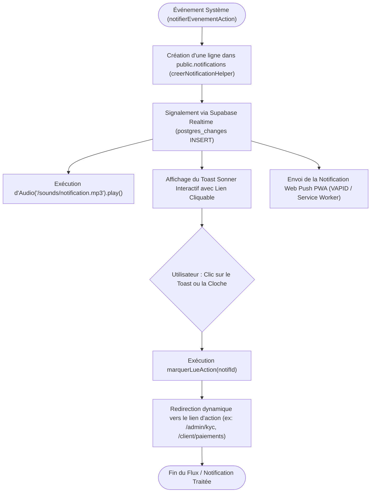

# Procédure de Flux : Dispatcher de Notifications Push, Emails et Alerte Sonore (FLOW-NOTIF-01)

---

## 1. Synthèse Exécutive

* **Famille de Flux** : `05_Notifications_Relances`
* **Code du Flux** : `FLOW-NOTIF-01`
* **Acteurs Principaux** : Tous les utilisateurs (Client Privé, Agent, Admin, Super Admin)
* **Objectif Fonctionnel** : Diffusion instantanée des notifications d'événements (nouveau prospect, réservation, confirmation de paiement, modération KYC) avec alerte sonore, notification web push PWA et toast dynamique avec lien de redirection.
* **Préréquis** : Abonnement Web Push actif (`NotificationService.tsx`) + Canal Supabase Realtime.
* **Livrables & État Final** : Entrée insérée dans `notifications`, son `/sounds/notification.mp3` joué, toast dynamique affiché, redirection au clic.

---

## 2. Matrice d'Habilitation RBAC (Rôles & Permissions)

| Événement Déclencheur | Destinataires | Sonnerie Audio | Redirection Cliquable |
| :--- | :--- | :--- | :--- |
| `NOUVEAU_LEAD` | Admins | Oui | `/admin/leads` |
| `LEAD_ATTRIBUE` | Agent concerné | Oui | `/admin/leads` |
| `RESERVATION_CREEE` | Client + Admins | Oui | `/client/dashboard` ou `/admin/reservations` |
| `PAIEMENT_CONFIRME` | Client + Agent + Admins | Oui | `/client/paiements` ou `/admin/paiements` |
| `KYC_SOUMIS` | Agents + Admins | Oui | `/admin/kyc` |
| `KYC_VALIDE` | Client | Oui | `/client/profil` |

---

## 3. Cartographie du Flux (Diagramme Mermaid)

---

## 4. Déroulé Algorithmique Détaillé en Langage Naturel (Du Début à la Fin)

Le flux de diffusion temps réel des notifications multi-canaux (Alerte Sonore, Toast interactif, Web Push PWA et Email) est modélisé sous la forme d'un algorithme réactif découpé en 5 étapes clés.

---

### Étape 1 — Déclenchement de l'Événement Métier (`notifierEvenementAction`)
* **Action** : Une opération importante se produit sur la plateforme (ex: un client soumet une pièce KYC, réserve une parcelle, valide un paiement par acompte ou un prospect demande à être recontacté).
* **Transmission au dispatcher** : La Server Action responsable de l'opération appelle la méthode centralisée `notifierEvenementAction(event, data)`.

---

### Étape 2 — Création de l'Entrée en Base de Données & Notification Realtime
* **Enregistrement en Base de Données** :
  * Le helper `creerNotificationHelper` génère une ligne dans la table `public.notifications` avec l'identifiant du destinataire, le titre, le message explicatif, la catégorie d'événement et l'URL de redirection ciblée (ex: `/admin/kyc`, `/client/paiements`).
* **Diffusion Temps Réel (`Supabase Realtime`)** :
  * La modification en base de données déclenche un événement WebSocket instantané sur le canal écourté de l'utilisateur connecté.

---

### Étape 3 — Émission de l’Alerte Sonore et du Toast Interactif Côté Navigateur
* **Action du composant récepteur (`NotificationsBell.tsx` / `NotificationService.tsx`)** :
  * **Déclenchement Audio** : Le navigateur joue la sonnerie officielle d'alerte (`/sounds/notification.mp3`) pour attirer immédiatement l'attention visuelle et auditive de l'utilisateur.
  * **Toast dynamique Sonner** : Un pavé interactif éphémère apparaît dans l'angle de l'écran indiquant le titre du message et un bouton d'action directe.

---

### Étape 4 — Émission de la Notification Web Push PWA sur Smartphone / Desktop
* **Action du Service Worker (`sw.js`)** :
  * En parallèle du signal WebSocket, le serveur envoie une notification Web Push cryptée via le protocole VAPID aux appareils enregistrés de l'utilisateur.
  * La notification s'affiche directement dans le centre de notifications du téléphone mobile ou du système d'exploitation de l'ordinateur, même si l'application est en arrière-plan.

---

### Étape 5 — Interaction Utilisateur, Acquitement et Redirection
* **Action de l'utilisateur** : L'utilisateur clique sur la notification Push, le toast interactif ou l'icône de cloche en haut de l'écran.
* **Traitement d'acquitement (`marquerLueAction`)** :
  * La notification bascule au statut lue (`is_read = true`) en base de données et le compteur de la cloche s'actualise.
  * L'utilisateur est automatiquement redirigé vers l'écran précis nécessitant son attention (ex: le dossier KYC soumis pour un administrateur, ou le reçu de paiement pour un client).

---

## 5. Synthèse des Contrôles de Sécurité & Résilience

1. **Isolation des Destinataires (RLS)** : Chaque utilisateur ne peut écouter sur le canal temps réel et consulter que les notifications destinées à son propre identifiant ou rôle.
2. **Résilience Multi-Canaux** : Si le navigateur de l'utilisateur est fermé, la notification Web Push PWA et l'email transactionnel assurent la délivrabilité complète de l'alerte.
3. **Contrôle d'Autorisation Audio** : La sonnerie sonore gère gracieusement les politiques d'auto-play des navigateurs en s'armant dès la première interaction de l'utilisateur sur la page.

---

## 6. Résumé Général du Fonctionnement

Afin d'assurer une réactivité irréprochable et d'informer instantanément les acquéreurs et l'équipe commerciale, Favor Company International s'appuie sur un système de notifications en temps réel. Dès qu'un événement majeur survient sur votre compte — comme la validation d'une pièce d'identité, la réception d'un paiement d'acompte ou une confirmation de réservation —, le système diffuse immédiatement l'information. Si vous êtes connecté sur la plateforme, un signal sonore harmonieux retentit et un pavé d'alerte cliquable apparaît sur votre écran. Même si votre téléphone ou votre ordinateur est en veille, une notification s'affiche directement sur votre appareil. En cliquant simplement sur le message, vous êtes immédiatement dirigé vers la page exacte de votre espace personnel correspondant à votre démarche, vous garantissant une prise en charge fluide et sans la moindre perte de temps.
