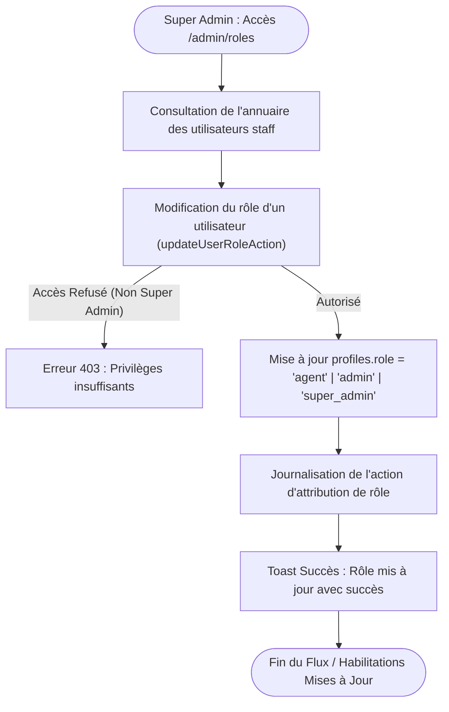

# Procédure de Flux : Gestion des Rôles RBAC et Habilitations Staff (FLOW-SUP-02)

---

## 1. Synthèse Exécutive

* **Famille de Flux** : `06_Support_Litiges`
* **Code du Flux** : `FLOW-SUP-02`
* **Acteurs Principaux** : Super Admin, Administrateur Système
* **Objectif Fonctionnel** : Attribution des rôles `agent`, `admin`, ou `super_admin` aux membres du personnel Favor Company (Responsables d'agences régionales, commerciaux, modérateurs) et audit des habilitations.
* **Préréquis** : Privilèges Super Admin uniquement.
* **Livrables & État Final** : Mise à jour de `profiles.role` dans la base de données, application immédiate lors des contrôles de permissions.

---

## 2. Matrice d'Habilitation RBAC (Rôles & Permissions)

| Rôle Cible | Portée des Privilèges | Écrans Autorisées |
| :--- | :--- | :--- |
| `agent` | Gestion locale / Agence régionale | `/admin/dashboard`, `/admin/leads`, `/admin/visites` |
| `admin` | Gestion globale des dossiers et du KYC | Tous les écrans `/admin/*` sauf la modification des rôles |
| `super_admin` | Contrôle d'accès total et configuration | Universel (`/admin/roles`, `/admin/configuration`) |

---

## 3. Cartographie du Flux (Diagramme Mermaid)

---

## 4. Déroulé Algorithmique Détaillé en Langage Naturel (Du Début à la Fin)

Le flux de gestion des habilitations administratives et d'attribution des rôles du personnel est modélisé sous la forme d'un algorithme de contrôle d'accès strict (RBAC) articulé en 4 étapes clés.

---

### Étape 1 — Accès à la Console de Gestion des Habilitations (`/admin/roles`)
* **Action** : Le Super Administrateur accède à la console d'administration des droits d'accès (`/admin/roles`).
* **Contrôle d'accès préalable** : Le serveur vérifie que la session active appartient à un utilisateur disposant du rôle `'super_admin'`.
  * *Si la session n'est pas habilitée* : La requête est interceptée avec une alerte de privilèges insuffisants (`403 Forbidden`).
  * *Si habilité* : L'annuaire complet des collaborateurs et de leurs niveaux d'accès s'affiche.

---

### Étape 2 — Sélection du Collaborateur et Attribution du Rôle (`updateUserRoleAction`)
* **Action** : Le Super Administrateur sélectionne la fiche du collaborateur et choisit le nouveau niveau d'habilitation dans le menu déroulant :
  * **Agent Commercial (`agent`)** : Accès limité au suivi de son portefeuille de clients, des visites et des réservations de son agence régionale.
  * **Administrateur (`admin`)** : Accès étendu au contrôle KYC, à la modération du catalogue et à la gestion comptable des paiements.
  * **Super Administrateur (`super_admin`)** : Privilèges globaux et autorisations sur la configuration système et l'attribution des rôles.

---

### Étape 3 — Mise à Jour Atomique et Application Immédiate des Droits
* **Action Serveur (`updateUserRoleAction`)** :
  * Le serveur exécute la mise à jour atomique de la colonne `role` dans la table `public.profiles`.
  * Les stratégies de sécurité en base de données (*Row Level Security - RLS*) appliquent immédiatement le nouveau périmètre de droits.
  * Si les droits d'un collaborateur sont révoqués, sa session active est instantanément mise à jour pour restreindre son accès.

---

### Étape 4 — Journalisation d'Audit et Notification
* **Traçabilité** : Chaque attribution, modification ou révocation de rôle est consignée dans le journal d'audit de sécurité avec l'identifiant du Super Administrateur auteur de l'action, l'horodatage précis et le nouveau rôle configuré.
* **Notification** : Un toast de confirmation confirme la mise à jour et un email d'information de modification de privilèges est adressé au collaborateur concerné.

---

## 5. Synthèse des Contrôles de Sécurité & Résilience

1. **Exclusivité du Super Admin** : La modification des rôles et des habilitations est une prérogative exclusive du Super Administrateur, empêchant toute auto-élévation de privilèges (*Privilege Escalation*).
2. **Effet Immédiat via RLS Supabase** : Toute modification de rôle s'applique sans délai à la requête suivante, garantissant un verrouillage immédiat en cas de départ ou de changement de poste d'un agent.
3. **Journal d'Audit Inviolable** : Historisation complète de toutes les modifications d'habilitation pour se conformer aux exigences de contrôle interne de Favor Company International.

---

## 6. Résumé Général du Fonctionnement

Pour garantir la confidentialité des données et la parfaite organisation de ses équipes, Favor Company International applique une politique stricte de gestion des accès et des responsabilités. Seule la haute direction, représentée par les super-administrateurs, dispose du pouvoir d'attribuer ou de modifier les niveaux d'habilitation du personnel. Chaque collaborateur — qu'il soit conseiller commercial sur le terrain ou responsable de la modération — se voit attribuer un rôle précis correspondant exactement à ses fonctions. Dès qu'un changement de responsabilité intervient, l'ajustement est immédiatement pris en compte par la plateforme : les accès de l'utilisateur s'adaptent à la seconde près et chaque modification est enregistrée dans un registre d'audit infalsifiable, assurant ainsi une sécurité maximale pour l'ensemble des opérations et des acquéreurs.
