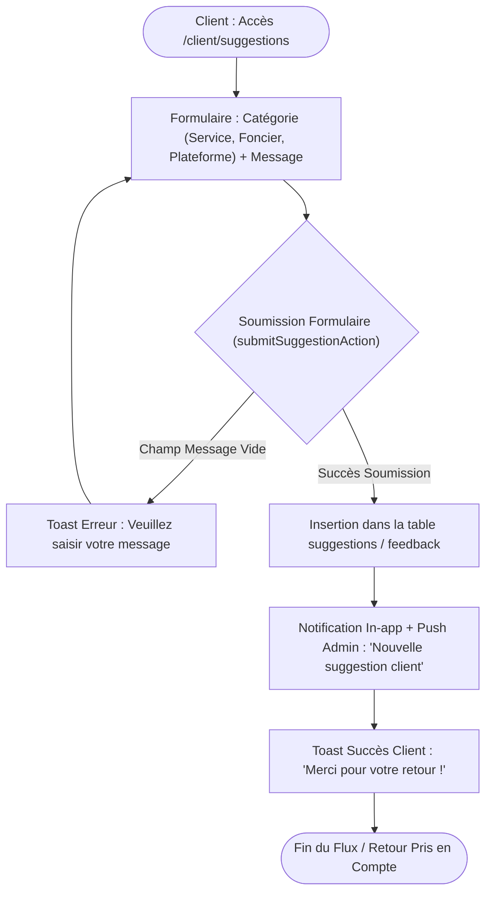

# Procédure de Flux : Suggestions, Retours et Réclamations Clients (FLOW-SUP-01)

---

## 1. Synthèse Exécutive

* **Famille de Flux** : `06_Support_Litiges`
* **Code du Flux** : `FLOW-SUP-01`
* **Acteurs Principaux** : Client Privé Acquéreur, Responsable Qualité / Admin
* **Objectif Fonctionnel** : Soumission d'une suggestion ou réclamation depuis l'Espace Client (`/client/suggestions`), qualification par le service support et notification de résolution.
* **Préréquis** : Compte client authentifié.
* **Livrables & État Final** : Entrée insérée dans `suggestions` / `feedback`, notification transmise à l'administrateur, accusé de réception affiché.

---

## 2. Matrice d'Habilitation RBAC (Rôles & Permissions)

| Rôle Utilisateur | Accès | Autorisances |
| :--- | :--- | :--- |
| **Client Privé** | `client` | Saisie d'une suggestion/réclamation par catégorie, consultation des réponses. |
| **Admin / Support** | `admin` | Traitement des tickets, réponse motivée, clôture administrative. |

---

## 3. Cartographie du Flux (Diagramme Mermaid)

---

## 4. Déroulé Algorithmique Détaillé en Langage Naturel (Du Début à la Fin)

Le flux de recueil, de qualification et de traitement des suggestions et réclamations clients est modélisé sous la forme d'un algorithme de gestion de la relation client articulé en 4 étapes clés.

---

### Étape 1 — Renseignement du Formulaire de Retour (`/client/suggestions`)
* **Action** : Le client connecté accède à la rubrique dédiée à la relation client (`/client/suggestions`).
* **Saisie des informations** :
  * Sélection de la catégorie concernée via le menu déroulant sur mesure (`CustomSelect`) : Service commercial, Aménagement foncier & visites, Fonctionnalités de la plateforme, ou Autre demande.
  * Rédaction du message explicatif détaillé (remarque, recommandation ou réclamation).
  * Possibilité de joindre une pièce justificative si nécessaire.

---

### Étape 2 — Validation et Enregistrement (`submitSuggestionAction`)
* **Action** : Le client clique sur le bouton *"Transmettre ma remarque"*.
* **Traitement Serveur** :
  * Le serveur contrôle la présence et la longueur minimale du message.
  * Une entrée est générée dans la table `public.suggestions` avec l'identifiant du client, la catégorie, le message, l'horodatage et le statut initial `'nouveau'`.
  * Un message de confirmation sous forme de Toast s'affiche sur l'écran du client : *"Merci pour votre retour ! Votre message a été transmis à notre direction commerciale."*

---

### Étape 3 — Notification du Service Client & Attribution
* **Notification Administrateur** :
  * Les responsables du service client et administrateurs reçoivent une notification in-app prioritaire accompagnée d'un signal sonore (`/sounds/notification.mp3`) sur leur console d'administration (`/admin/suggestions`).
* **Attribution du Ticket** :
  * Le ticket est affecté à un conseiller référent pour analyse et prise en charge.

---

### Étape 4 — Traitement, Réponse & Clôture du Ticket
* **Action du conseiller support** :
  * Le responsable consulte le message du client et apporte une réponse motivée ou prend les mesures correctives nécessaires.
* **Résolution** :
  * La réponse officielle est enregistrée et le statut du ticket passe à `'traite'` ou `'resolu'`.
  * Le client reçoit une notification automatique l'invisant à consulter la réponse du service client depuis son espace personnel.

---

## 5. Synthèse des Contrôles de Sécurité & Résilience

1. **Vérification d'Authentification Stricte** : Seuls les clients authentifiés disposant d'un compte valide peuvent soumettre des retours, prévenant le spam et garantissant l'identification de l'auteur.
2. **Nettoyage des Contenus (Sanitization)** : Filtrage strict des caractères et balises HTML dans les messages de réclamation pour éviter toute injection malveillante.
3. **Traçabilité de l'Amélioration Continue** : Les suggestions sont archivées et catégorisées pour alimenter les bilans de qualité de Favor Company International.

---

## 6. Résumé Général du Fonctionnement

Favor Company International place la satisfaction de ses acquéreurs au cœur de son exigence de Promoteur Immobilier Agréé. À travers l'espace "Suggestions et Réclamations", chaque client peut à tout moment partager ses remarques, formuler une recommandation ou exprimer une préoccupation liée à son projet d'achat. Pour cela, il lui suffit de choisir la catégorie de son message et de rédiger ses observations en toute liberté depuis son espace privé. Dès la soumission du formulaire, le message est instantanément transmis à la direction commerciale et au service qualité. Un conseiller étudie la demande avec attention et y apporte une réponse personnalisée dans les meilleurs délais. L'acquéreur est alors immédiatement averti dès la publication de la réponse, lui garantissant une écoute attentive et un suivi transparent à chaque étape de son parcours immobilier.
