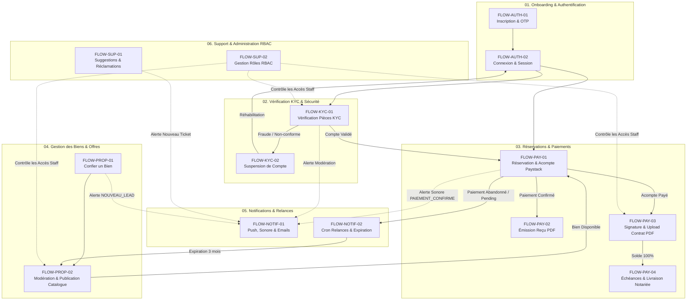

# Cartographie Globale des Flux, Liaisons et Dépendances (MASTER-FLOW-MAP)

---

## 1. Synthèse Exécutive

* **Organisme** : Favor Company International — Promoteur Immobilier Agréé
* **Code Document** : `MASTER-FLOW-MAP`
* **Objet** : Document officiel de cartographie des 13 flux opérationnels de l'écosystème, détaillant la matrice d'interconnexion, les prérequis, les déclencheurs et l'enchaînement des processus d'acquisition foncière et immobilière.
* **Champ d'Application** : Tous les modules fonctionnels (`01_Onboarding_Auth`, `02_KYC_Verification`, `03_Reservations_Paiements`, `04_Gestion_Biens_Offres`, `05_Notifications_Relances`, `06_Support_Litiges`).

---

## 2. Cartographie Globale d'Interconnexion (Diagramme Mermaid)

---

## 3. Matrice Détaillée des 13 Flux, Dépendances & Déclencheurs

| Code Flux | Titre Officiel du Flux | Dépend de (Préréquis) | Déclenche / Transmet à | Fichier de Procédure Associé |
| :--- | :--- | :--- | :--- | :--- |
| **`FLOW-AUTH-01`** | Inscription & Authentification OTP | *(Aucun - Point d'entrée)* | Transmet vers `FLOW-AUTH-02` (Connexion) et exige la vérification dans `FLOW-KYC-01`. | [`01_Onboarding_Auth/PROCEDURE_INSCRIPTION_AUTHENTIFICATION.md`](file:///FavorCompany_Flux/01_Onboarding_Auth/PROCEDURE_INSCRIPTION_AUTHENTIFICATION.md) |
| **`FLOW-AUTH-02`** | Connexion & Réinitialisation Mot de Passe | `FLOW-AUTH-01` | Débloque l'accès aux espaces réservés (`/client/*` et `/admin/*`). | [`01_Onboarding_Auth/PROCEDURE_CONNEXION_REINITIALISATION_MOT_DE_PASSE.md`](file:///FavorCompany_Flux/01_Onboarding_Auth/PROCEDURE_CONNEXION_REINITIALISATION_MOT_DE_PASSE.md) |
| **`FLOW-KYC-01`** | Vérification d'Identité KYC | `FLOW-AUTH-02` | Déclenche une alerte dans `FLOW-NOTIF-01`. Si validé $\rightarrow$ Autorise `FLOW-PAY-01`. Si litige $\rightarrow$ Transmet à `FLOW-KYC-02`. | [`02_KYC_Verification/PROCEDURE_KYC_VERIFICATION.md`](file:///FavorCompany_Flux/02_KYC_Verification/PROCEDURE_KYC_VERIFICATION.md) |
| **`FLOW-KYC-02`** | Suspension & Déblocage de Compte | `FLOW-KYC-01` ou décision Admin | Bloque toutes les actions de l'utilisateur. Si réhabilité $\rightarrow$ Restitue l'accès dans `FLOW-AUTH-02`. | [`02_KYC_Verification/PROCEDURE_SUSPENSION_DEBLOCAGE_COMPTE.md`](file:///FavorCompany_Flux/02_KYC_Verification/PROCEDURE_SUSPENSION_DEBLOCAGE_COMPTE.md) |
| **`FLOW-PROP-01`** | Soumission "Confier un Bien" & Expertise | `FLOW-AUTH-01` / `FLOW-AUTH-02` | Transmet le dossier au pôle d'ingénierie et déclenche `FLOW-NOTIF-01` (Alerte Manager). Après étude $\rightarrow$ Transmet à `FLOW-PROP-02`. | [`04_Gestion_Biens_Offres/PROCEDURE_CONFIER_ET_PUBLIER_BIEN.md`](file:///FavorCompany_Flux/04_Gestion_Biens_Offres/PROCEDURE_CONFIER_ET_PUBLIER_BIEN.md) |
| **`FLOW-PROP-02`** | Modération & Publication Catalogue | `FLOW-PROP-01` ou création Staff | Rend le bien disponible au catalogue public (`/biens`), ouvrant la voie à `FLOW-PAY-01`. | [`04_Gestion_Biens_Offres/PROCEDURE_MODERATION_PUBLICATION_CATALOGUE.md`](file:///FavorCompany_Flux/04_Gestion_Biens_Offres/PROCEDURE_MODERATION_PUBLICATION_CATALOGUE.md) |
| **`FLOW-PAY-01`** | Réservation & Paiement d'Acompte | `FLOW-AUTH-02` + `FLOW-KYC-01` + `FLOW-PROP-02` | **En cas de succès** : Déclenche `FLOW-NOTIF-01` (Alerte Sonore Agent), `FLOW-PAY-02` (Reçu PDF) et `FLOW-PAY-03` (Signature Contrat). **En cas d'abandon** : Transmet à `FLOW-NOTIF-02` (Cron Relances). | [`03_Reservations_Paiements/PROCEDURE_RESERVATION_PAIEMENT.md`](file:///FavorCompany_Flux/03_Reservations_Paiements/PROCEDURE_RESERVATION_PAIEMENT.md) |
| **`FLOW-PAY-02`** | Émission de Factures & Reçus Certifiés PDF | `FLOW-PAY-01` (`statut = COMPLETED`) | Génère le reçu certifié PDF disponible pour le client et pour l'archivage dans `FLOW-PAY-03`. | [`03_Reservations_Paiements/PROCEDURE_EMISSION_FACTURES_RECUS.md`](file:///FavorCompany_Flux/03_Reservations_Paiements/PROCEDURE_EMISSION_FACTURES_RECUS.md) |
| **`FLOW-PAY-03`** | Signature Manuscrite & Transmission Contrat PDF | `FLOW-PAY-01` + `FLOW-PAY-02` | Débloque l'interface agent pour la signature manuscrite et le téléversement du contrat scanné (`.pdf`). | [`03_Reservations_Paiements/Procedure_Recus_Transmissions_Contrats.md`](file:///FavorCompany_Flux/03_Reservations_Paiements/Procedure_Recus_Transmissions_Contrats.md) |
| **`FLOW-PAY-04`** | Suivi Échéances & Livraison Finale Documents | `FLOW-PAY-03` (Contrat signé) | Validation des mensualités (100%), quittance de solde, acte notarié (ACD), PV de livraison et remise des clés. | [`03_Reservations_Paiements/PROCEDURE_PAIEMENT_ECHEANCES_LIVRAISON_DOCUMENTS.md`](file:///FavorCompany_Flux/03_Reservations_Paiements/PROCEDURE_PAIEMENT_ECHEANCES_LIVRAISON_DOCUMENTS.md) |
| **`FLOW-NOTIF-01`** | Dispatcher Push, Sonore & Email | *Service Transverse* | Reçoit les signaux de `FLOW-KYC-01`, `FLOW-PROP-01`, `FLOW-PAY-01`, `FLOW-SUP-01` et diffuse en temps réel (Audio, Web Push, Toast). | [`05_Notifications_Relances/PROCEDURE_NOTIFICATIONS_PUSH_SONORES.md`](file:///FavorCompany_Flux/05_Notifications_Relances/PROCEDURE_NOTIFICATIONS_PUSH_SONORES.md) |
| **`FLOW-NOTIF-02`** | Cron Relances Automatiques & Expiration | `FLOW-PAY-01` (Réservations en attente) | Relance le client à 48h et 7j. Après 3 mois sans acompte $\rightarrow$ Annule la réservation et remet le bien au catalogue dans `FLOW-PROP-02`. | [`05_Notifications_Relances/PROCEDURE_CRON_RELANCES_AUTOMATIQUES.md`](file:///FavorCompany_Flux/05_Notifications_Relances/PROCEDURE_CRON_RELANCES_AUTOMATIQUES.md) |
| **`FLOW-SUP-01`** | Suggestions, Retours et Réclamations | `FLOW-AUTH-02` | Envoie un ticket au support et déclenche une alerte dans `FLOW-NOTIF-01`. | [`06_Support_Litiges/PROCEDURE_SUGGESTIONS_RECLAMATIONS_CLIENTS.md`](file:///FavorCompany_Flux/06_Support_Litiges/PROCEDURE_SUGGESTIONS_RECLAMATIONS_CLIENTS.md) |
| **`FLOW-SUP-02`** | Gestion des Rôles RBAC & Habilitations | `FLOW-AUTH-02` (Super Admin uniquement) | Détermine le niveau d'habilitation (`agent`, `admin`, `super_admin`) nécessaire pour exécuter `FLOW-KYC-01`, `FLOW-PROP-02`, `FLOW-PAY-03`, etc. | [`06_Support_Litiges/PROCEDURE_GESTION_ROLES_HABILITATIONS.md`](file:///FavorCompany_Flux/06_Support_Litiges/PROCEDURE_GESTION_ROLES_HABILITATIONS.md) |

---

## 4. Parcours Métier Majeurs (Les 3 Grands Enchaînements)

### Parcours 1 : Acquisition d'un Bien d'Exception (Parcours Vente)
1. **Création de compte** : L'acquéreur s'inscrit et confirme son email par OTP (`FLOW-AUTH-01`).
2. **Identification KYC** : Il dépose sa pièce d'identité officielle pour validation par l'administration (`FLOW-KYC-01`).
3. **Sélection du bien** : Il parcourt le catalogue des villas et parcelles viabilisées mises en ligne par l'équipe (`FLOW-PROP-02`).
4. **Réservation & Acompte** : Il réserve son lot en réglant l'acompte de 10% par Mobile Money ou carte bancaire (`FLOW-PAY-01`).
5. **Délivrance de la preuve** : Son reçu officiel d'acompte certifié (TVA 18% CI / OHADA) est généré en PDF (`FLOW-PAY-02`).
6. **Signature & Scellement** : Il rencontre son conseiller pour la signature manuscrite du contrat papier, qui est ensuite numérisé au format PDF et archivé sur la plateforme (`FLOW-PAY-03`).
7. **Échéances & Livraison Notariée** : Il règle le solde des mensualités (100%), obtient sa quittance de solde finale, signe l'acte authentique chez le notaire (ACD/Titre Foncier) et procède à la remise officielle des clés sur le terrain (`FLOW-PAY-04`).

---

### Parcours 2 : Apport Foncier & Promotion Immobilière (Parcours Propriétaire)
1. **Soumission de l'offre** : Un propriétaire foncier transmet les caractéristiques et titres de sa parcelle via le formulaire "Confier un Bien" (`FLOW-PROP-01`).
2. **Notification du manager** : Le responsable de zone reçoit une alerte sonore et Push (`FLOW-NOTIF-01`).
3. **Expertise terrain & Juridique** : L'équipe d'ingénierie Favor Company vérifie le titre (ACD) auprès du Ministère de la Construction et réalise l'étude topographique.
4. **Publication officielle** : Le bien est homologué et publié dans le catalogue officiel (`FLOW-PROP-02`).

---

### Parcours 3 : Protection du Foncier & Relances Automatiques (Parcours Recyclage)
1. **Réservation incomplète** : Une option est posée par un client sans versement d'acompte (`FLOW-PAY-01`).
2. **Relances automatisées** : Le serveur Cron envoie une relance amiable à 48 heures, puis une mise en garde à 7 jours (`FLOW-NOTIF-02`).
3. **Expiration à 3 mois** : Si aucun paiement n'est enregistré au bout de 3 mois, la réservation est automatiquement annulée et la parcelle est remise en disponibilité sur le catalogue (`FLOW-PROP-02`).

---

## 5. Synthèse de Gouvernance & Sécurité Système

1. **Sécurité Transversale RBAC (`FLOW-SUP-02`)** : L'accès aux interfaces administratives est strictement gouverné par les rôles `agent`, `admin` et `super_admin`.
2. **Intégrité Financière & Fiscale (`FLOW-PAY-02`)** : Chaque encaissement respecte la réglementation OHADA et la législation ivoirienne sur la promotion immobilière agréée.
3. **Réactivité Temps Réel (`FLOW-NOTIF-01`)** : La combinaison de Supabase Realtime, des signaux sonores audio et du Web Push PWA assure zéro délai dans la prise en charge des demandes clients.

---

## 6. Résumé Général du Fonctionnement

L'ensemble de la plateforme de Favor Company International a été pensé comme un grand parcours de confiance où chaque étape s'enchaîne naturellement pour accompagner l'acquéreur depuis son premier contact jusqu'à la remise de son bien immobilier. Tout commence lorsque vous créez votre espace personnel et confirmez votre identité en transmettant une copie de votre pièce officielle, permettant à nos équipes de vous identifier et de sécuriser vos futures démarches. En parallèle, nos experts fonciers et nos responsables régionaux étudient les terrains et les bâtiments proposés par des propriétaires désireux de valoriser leur patrimoine, en vérifiant minutieusement les titres de propriété auprès des autorités compétentes avant de les présenter dans le catalogue officiel de la maison. Dès qu'un projet retient votre attention, vous pouvez réserver immédiatement votre lot en effectuant le versement de votre acompte directement depuis votre téléphone portable ou votre carte bancaire. À cet instant précis, un signal sonore avertit votre conseiller commercial qui prend le relais pour organiser la rencontre solennelle au cours de laquelle vous signerez ensemble le contrat officiel sur papier. Ce document est ensuite numérisé et conservé en toute sécurité dans votre espace privé, tandis que vos reçus de paiement au format officiel restent à votre disposition pour vos démarches notariales. Enfin, si une réservation venait à être abandonnée, le système se charge d'adresser des rappels courtois avant de remettre la parcelle à la disposition d'un autre acheteur, garantissant ainsi une gestion transparente, réactive et parfaitement fluide pour l'ensemble des acteurs.

