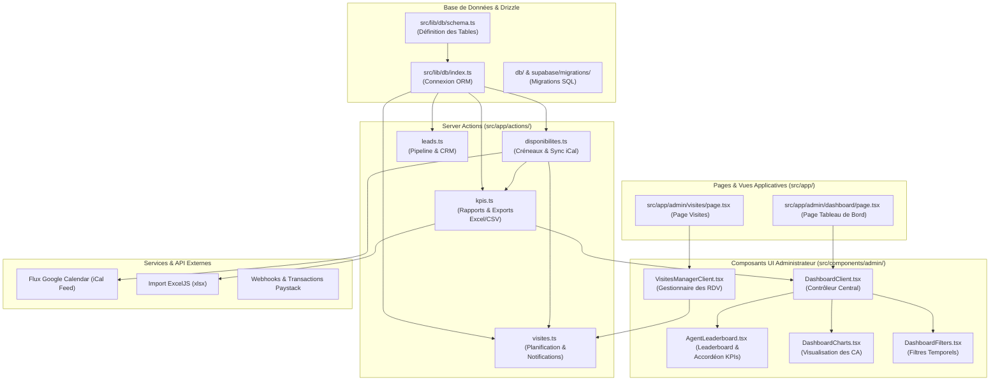

# Manifeste d'Arborescence & Carte Mentale Technique — Favor Company International

> [!IMPORTANT]
> **Directive de Maintenance IA Obligatoire**
> - **Ce fichier est la carte de référence pour toutes les intelligences artificielles (ou développeurs) intervenant sur le dépôt.**
> - À chaque fois qu'un fichier ou un dossier est **créé, renommé, modifié ou supprimé**, l'IA doit immédiatement et obligatoirement mettre à jour ce manifeste.
> - Pour chaque modification, mettez à jour la description du fichier, son niveau d'importance, ainsi que ses dépendances entrantes/sortantes (les fichiers qu'il appelle et par qui il est appelé).

---

## 🗺️ Diagramme d'Architecture Global

Le schéma ci-dessous modélise les flux et les dépendances du projet par couche applicative :

---

## 📂 Structure Générale des Répertoires

| Répertoire | Rôle & Contenu | Niveau d'Importance |
|---|---|---|
| **[[.skills/](./.skills)]** | Contient l'ensemble des règles métiers et prompts IA (Chef de projet, conformité légale Côte d'Ivoire, sécurité OWASP, RLS, etc.). | **Critique** |
| **[[locust-load-tests/](./locust-load-tests)]** | Dossier opérationnel de tests de charge et de performance avec Locust (scénarios, configurations, guide méthodologique). | **Moyen** |
| **[[memoire-favor/](./memoire-favor)]** | Journal de session brut (`fourtour/`) et wiki d'apprentissage (`wiki/`) pour la continuité IA. | **Élevé** |
| **[[src/app/](./src/app)]** | Structure Next.js App Router (Pages, layouts et API Routes du projet). | **Critique** |
| **[[src/app/actions/](./src/app/actions)]** | Server Actions d'interaction avec la base de données (se substitue aux routes d'API). | **Critique** |
| **[[src/components/](./src/components)]** | Composants d'interface (Admin, Public, Client, Shared, UI de base). | **Élevé** |
| **[[src/lib/](./src/lib)]** | Logique métier interne (connexion DB, sécurité, intégration de passerelle Paystack, stockage Cloudflare R2, notifications Resend). | **Critique** |
| **[[db/](./db)]** | Fichiers de migration SQL bruts générés pour le déploiement sur Supabase. | **Élevé** |
| **[[INFO_MOCKER/](./INFO_MOCKER)]** | Données de simulation SQL (seeding) et scripts d'initialisation de contenu. | **Moyen** |
| **[[PROMPTS/](./PROMPTS)]** | Cahier des charges, spécifications d'architecture, de design, de DB et roadmap de développement. | **Élevé** |
| **[[public/](./public)]** | Fichiers statiques et médias (images de miniature, photos du Hero, logos Favor Company). | **Moyen** |

---

## 🎯 Fichiers Stratégiques & Cartographie des Dépendances

### 1. Base de Données & Modèle
*   #### 📄 **[schema.ts](./src/lib/db/schema.ts)**
    *   **Description** : Fichier central définissant toutes les tables du projet (profils utilisateurs, leads, biens, réservations, visites physiques, paiements, configurations iCal, etc.) via Drizzle ORM.
    *   **Importance** : **Critique**
    *   **Dépendances Sortantes (Appelle)** : Néant (uniquement packages tiers `drizzle-orm`).
    *   **Dépendances Entrantes (Appelé par)** :
        *   [index.ts](./src/lib/db/index.ts)
        *   Toutes les Server Actions sous [src/app/actions/](./src/app/actions)
        *   Les scripts de mock comme [seed_mock_bien.ts](./seed_mock_bien.ts)

*   #### 📄 **[index.ts](./src/lib/db/index.ts)**
    *   **Description** : Initialisation du client de connexion PostgreSQL et export de l'instance Drizzle `db`.
    *   **Importance** : **Critique**
    *   **Dépendances Sortantes (Appelle)** : [schema.ts](./src/lib/db/schema.ts)
    *   **Dépendances Entrantes (Appelé par)** :
        *   Toutes les Server Actions sous [src/app/actions/](./src/app/actions)

---

### 2. Logiques Métier (Server Actions)
*   #### 📄 **[kpis.ts](./src/app/actions/kpis.ts)**
    *   **Description** : Calcule les revenus financiers, taux de conversion, et performances des agents. Gère la génération et l'export des classements CRM en XLSX et CSV.
    *   **Importance** : **Élevé**
    *   **Dépendances Sortantes (Appelle)** :
        *   [index.ts](./src/lib/db/index.ts)
        *   [schema.ts](./src/lib/db/schema.ts)
        *   [disponibilites.ts](./src/app/actions/disponibilites.ts) (import dynamique de `fetchAgentICalEvents`)
    *   **Dépendances Entrantes (Appelé par)** :
        *   [DashboardClient.tsx](./src/components/admin/DashboardClient.tsx)

*   #### 📄 **[disponibilites.ts](./src/app/actions/disponibilites.ts)**
    *   **Description** : Gère les plages horaires d'ouverture des agents commerciaux, les absences locales, et parse l'intégration des flux externes Google Calendar (iCal) avec un cache de 15 minutes et un timeout réseau sécurisé de 3s.
    *   **Importance** : **Élevé**
    *   **Dépendances Sortantes (Appelle)** :
        *   [index.ts](./src/lib/db/index.ts)
        *   [schema.ts](./src/lib/db/schema.ts)
    *   **Dépendances Entrantes (Appelé par)** :
        *   [kpis.ts](./src/app/actions/kpis.ts)
        *   [visites.ts](./src/app/actions/visites.ts)
        *   [AgendaSettingsForm.tsx](./src/components/admin/AgendaSettingsForm.tsx)

*   #### 📄 **[visites.ts](./src/app/actions/visites.ts)**
    *   **Description** : Gère la création, modification, clôture et suppression des rendez-vous de visite. Inclut le routage automatique vers un agent disponible et la génération des notifications.
    *   **Importance** : **Élevé**
    *   **Dépendances Sortantes (Appelle)** :
        *   [index.ts](./src/lib/db/index.ts)
        *   [schema.ts](./src/lib/db/schema.ts)
        *   [disponibilites.ts](./src/app/actions/disponibilites.ts)
    *   **Dépendances Entrantes (Appelé par)** :
        *   [VisitesManagerClient.tsx](./src/components/admin/VisitesManagerClient.tsx)

*   #### 📄 **[leads.ts](./src/app/actions/leads.ts)**
    *   **Description** : Moteur de gestion des opportunités et des prospects. Gère le scoring d'activité, le déplacement des étapes dans le pipeline CRM et l'assignation d'agent commercial.
    *   **Importance** : **Élevé**
    *   **Dépendances Sortantes (Appelle)** :
        *   [index.ts](./src/lib/db/index.ts)
        *   [schema.ts](./src/lib/db/schema.ts)
    *   **Dépendances Entrantes (Appelé par)** :
        *   [LeadsManagerClient.tsx](./src/components/admin/LeadsManagerClient.tsx)
        *   [KanbanPipeline.tsx](./src/components/admin/KanbanPipeline.tsx)

*   #### 📄 **[analytics.ts](./src/app/actions/analytics.ts)**
    *   **Description** : Actions d'enregistrement anonyme du consentement aux cookies en base de données, et agrégation des statistiques de clics pour le dashboard Super Admin.
    *   **Importance** : **Élevé**
    *   **Dépendances Sortantes (Appelle)** :
        *   [index.ts](./src/lib/db/index.ts)
        *   [schema.ts](./src/lib/db/schema.ts)
    *   **Dépendances Entrantes (Appelé par)** :
        *   [CookieConsent.tsx](./src/components/shared/CookieConsent.tsx)
        *   [DashboardClient.tsx](./src/components/admin/DashboardClient.tsx)

*   #### 📄 **[push.ts](./src/app/actions/push.ts)**
    *   **Description** : Server Actions permettant d'enregistrer, de supprimer et de mettre à jour les abonnements de notifications push PWA en base de données avec gestion fine des préférences utilisateur. Contient également le helper d'émission de notifications.
    *   **Importance** : **Élevé**
    *   **Dépendances Sortantes (Appelle)** :
        *   [index.ts](./src/lib/db/index.ts)
        *   [schema.ts](./src/lib/db/schema.ts)
        *   [webpush-service.ts](./src/lib/notifications/webpush-service.ts)
    *   **Dépendances Entrantes (Appelé par)** :
        *   [NotificationService.tsx](./src/components/shared/NotificationService.tsx)
        *   [adminBiens.ts](./src/app/actions/adminBiens.ts)

---

### 3. Contrôleurs & Interfaces d'Administration
*   #### 📄 **[DashboardClient.tsx](./src/components/admin/DashboardClient.tsx)**
    *   **Description** : Composant orchestrateur du tableau de bord d'administration. Récupère les KPIs, filtre les périodes de données, déclenche les exports et affiche les statistiques globales.
    *   **Importance** : **Élevé**
    *   **Dépendances Sortantes (Appelle)** :
        *   [kpis.ts](./src/app/actions/kpis.ts)
        *   [DashboardCharts.tsx](./src/components/admin/DashboardCharts.tsx)
        *   [DashboardFilters.tsx](./src/components/admin/DashboardFilters.tsx)
        *   [AgentLeaderboard.tsx](./src/components/admin/AgentLeaderboard.tsx)
    *   **Dépendances Entrantes (Appelé par)** :
        *   `src/app/admin/dashboard/page.tsx`

*   #### 📄 **[AgentLeaderboard.tsx](./src/components/admin/AgentLeaderboard.tsx)**
    *   **Description** : Affiche le classement des commerciaux Favor Company. Comprend un menu de tri par KPI (conversion, occupation, heures terrain, ventes) et un accordéon animé par agent affichant le détail de ses statistiques.
    *   **Importance** : **Élevé**
    *   **Dépendances Sortantes (Appelle)** : Néant (uniquement composants de style tiers).
    *   **Dépendances Entrantes (Appelé par)** :
        *   [DashboardClient.tsx](./src/components/admin/DashboardClient.tsx)

---

### 4. Tests de Charge & Validation (Locust)
*   #### 📄 **[guide_validation_et_charge.md](./locust-load-tests/guide_validation_et_charge.md)**
    *   **Description** : Guide de méthodologie QA, types de tests de charge (Smoke, Load, Stress, Soak, Spike), validation fonctionnelle, sécurité, accessibilité et Core Web Vitals.
    *   **Importance** : **Moyen**
    *   **Dépendances Sortantes (Appelle)** : Néant
    *   **Dépendances Entrantes (Appelé par)** : Document de référence pour l'assurance qualité.
*   #### 📄 **[SKILL.md](./.skills/run-load-test/SKILL.md)**
    *   **Description** : Spécification et instructions opérationnelles détaillées pour configurer, exécuter et analyser des tests de performance automatisés à l'aide de Locust.
    *   **Importance** : **Élevé**
    *   **Dépendances Sortantes (Appelle)** : Scripts d'automatisation (`run_headless.py`, `run_stress_test.py`)
    *   **Dépendances Entrantes (Appelé par)** : Chefs de projet et agents QA intervenant sur les campagnes de charge.
*   #### 📄 **[SKILL.md](./.skills/skill-markitdown-master/SKILL.md)**
    *   **Description** : Spécification du skill `skill-markitdown-master` d'ingestion universelle de fichiers (Word, PDF, Excel), extraction OCR Gemini, injection de métadonnées YAML et balisage sémantique pour l'entraînement d'IA et la génération de quiz.
    *   **Importance** : **Élevé**
    *   **Dépendances Sortantes (Appelle)** : `.skills/immo-ci/SKILL.md`, `.skills/copywriting/SKILL.md`, `.skills/securite-favor/SKILL.md`, `.skills/skills-main/skills/docx/SKILL.md`, `.skills/skills-main/skills/pdf/SKILL.md`, `.skills/skills-main/skills/xlsx/SKILL.md`
    *   **Dépendances Entrantes (Appelé par)** : `chefs-favor`, `contrats`, `legal`, `crm`, `architecte`

---

## 🧪 Module de Tests Automatisés (`/tests`)

> Tests unitaires (Vitest), E2E (Playwright) et accessibilité (Axe-core) pour l'assurance qualité continue.

### Configuration

*   #### 📄 **[vitest.config.ts](./vitest.config.ts)**
    *   **Description** : Configuration Vitest — environnement Node, alias `@/` vers `./src`, exclusion du dossier `tests/e2e`.
    *   **Importance** : **Élevé**
*   #### 📄 **[playwright.config.ts](./playwright.config.ts)**
    *   **Description** : Configuration Playwright — lancement automatique du serveur Next.js local, navigateur Chromium, traces activées au premier retry.
    *   **Importance** : **Élevé**

### Tests Unitaires & d'Intégration (Vitest)

*   #### 📄 **[newsletter.test.ts](./tests/unit/newsletter.test.ts)**
    *   **Description** : 3 cas de test — validation d'email invalide, détection d'abonné existant, insertion d'un nouvel abonné. Mock de la couche Drizzle DB.
    *   **Importance** : **Moyen**
    *   **Dépendances Sortantes (Appelle)** : `src/app/actions/newsletter.ts`, `src/lib/db/index.ts`
*   #### 📄 **[disponibilites.test.ts](./tests/unit/disponibilites.test.ts)**
    *   **Description** : 3 cas de test — fetch réseau sans cache, utilisation du cache iCal, gestion de timeout/erreur réseau. Mock de `parseICal` et `global.fetch`.
    *   **Importance** : **Moyen**
    *   **Dépendances Sortantes (Appelle)** : `src/app/actions/disponibilites.ts`, `src/lib/calendar/ical-parser.ts`

### Tests E2E (Playwright)

*   #### 📄 **[catalog.spec.ts](./tests/e2e/catalog.spec.ts)**
    *   **Description** : Navigation vers le catalogue de biens, recherche textuelle par filtres, et navigation vers la fiche de détail d'un bien.
    *   **Importance** : **Élevé**
    *   **Dépendances Sortantes (Appelle)** : Pages `/biens` et `/biens/[slug]`
*   #### 📄 **[auth.spec.ts](./tests/e2e/auth.spec.ts)**
    *   **Description** : Vérification du formulaire de connexion, test de rejet d'identifiants invalides, contrôle de la redirection.
    *   **Importance** : **Élevé**
    *   **Dépendances Sortantes (Appelle)** : Page `/auth/login`
*   #### 📄 **[crm.spec.ts](./tests/e2e/crm.spec.ts)**
    *   **Description** : Validation de la transition conditionnelle (gating) CRM — tentative de glissement de prospect dans le Kanban, ouverture de la modal de validation interactive, et blocage si les critères obligatoires sont manquants.
    *   **Importance** : **Élevé**
    *   **Dépendances Sortantes (Appelle)** : Page `/admin/leads`

### Tests d'Accessibilité (Axe-core)

*   #### 📄 **[accessibility.spec.ts](./tests/e2e/accessibility.spec.ts)**
    *   **Description** : Audit WCAG 2.0 AA automatisé sur la page d'accueil et le catalogue. Détection des violations critiques et sérieuses via Axe-core.
    *   **Importance** : **Élevé**
    *   **Dépendances Sortantes (Appelle)** : Pages `/` et `/biens`

## 📱 Module PWA, Offline & Notifications (`/public/` & `/src/hooks/`)

> Gestion de la résilience réseau (Offline-first), installation mobile et système de notifications Push et audio.

### Fichiers de Configuration PWA

*   #### 📄 **[manifest.json](./public/manifest.json)**
    *   **Description** : Fichier de manifeste PWA définissant le nom de l'application, les couleurs du thème (#1A2A4A, #F8F6F1) et les logos installables.
    *   **Importance** : **Élevé**
*   #### 📄 **[sw.js](./public/sw.js)**
    *   **Description** : Service Worker gérant la mise en cache de l'App Shell hors-ligne et l'écoute des événements Push (notifications d'écran).
    *   **Importance** : **Élevé**

### Hooks & Services Applicatifs

*   #### 📄 **[useOfflineLeadSubmit.ts](./src/hooks/useOfflineLeadSubmit.ts)**
    *   **Description** : Hook personnalisé gérant la file d'attente locale des Leads (`localStorage`) en cas d'absence de réseau, avec synchronisation automatique en tâche de fond au retour de la connexion (`online` event).
    *   **Importance** : **Élevé**
    *   **Dépendances Sortantes (Appelle)** : Server Actions de création de leads.
*   #### 📄 **[UpdateDetector.tsx](./src/components/shared/UpdateDetector.tsx)**
    *   **Description** : Composant client vérifiant toutes les 5 minutes la version du build serveur via `/api/version` pour proposer une actualisation immédiate de l'UI.
    *   **Importance** : **Moyen**
    *   **Dépendances Sortantes (Appelle)** : API `/api/version`
*   #### 📄 **[NotificationService.tsx](./src/components/shared/NotificationService.tsx)**
    *   **Description** : Composant de fond gérant l'enregistrement du Service Worker, l'autorisation des notifications sur écran, l'abonnement push VAPID et la sonnerie d'alerte (`notification.mp3`).
    *   **Importance** : **Élevé**
    *   **Dépendances Sortantes (Appelle)** :
        *   [push.ts](./src/app/actions/push.ts)
*   #### 📄 **[webpush-service.ts](./src/lib/notifications/webpush-service.ts)**
    *   **Description** : Helper backend utilisant le module `web-push` pour signer et envoyer des notifications push via le protocole VAPID.
    *   **Importance** : **Élevé**
    *   **Dépendances Entrantes (Appelé par)** :
        *   [push.ts](./src/app/actions/push.ts)
*   #### 📄 **[CookieConsent.tsx](./src/components/shared/CookieConsent.tsx)**
    *   **Description** : Composant de consentement aux cookies affichant un bandeau de confidentialité élégant avec persistance locale (`localStorage`).
    *   **Importance** : **Élevé**
*   #### 📄 **[TrackingScripts.tsx](./src/components/shared/TrackingScripts.tsx)**
    *   **Description** : Composant client injectant de façon conditionnelle les tags Google Analytics et Facebook Pixel en fonction du consentement aux cookies de l'utilisateur.
    *   **Importance** : **Élevé**

---
## 📈 Module de Tests de Charge & Performance (`/locust-load-tests/`)

> Scénarios de tests de charge progressifs et outils d'orchestration pour mesurer la robustesse de l'application et identifier les goulots d'étranglement.

### Outils & Scripts de Charge
*   #### 📄 **[run_stress_tests.py](./locust-load-tests/run_stress_tests.py)**
    *   **Description** : Script Python d'orchestration orchestrant les 4 étapes progressives (de Smoke Test à 1000 utilisateurs simultanés) en mode headless, avec arrêt automatique en cas de rupture.
    *   **Importance** : **Élevé**
*   #### 📄 **[new_features_load_test.py](./locust-load-tests/scenarios/new_features_load_test.py)**
    *   **Description** : Scénario Locust simulant les requêtes POST concurrentes à `/api/analytics` pour le tracking d'analytics local, et les lectures lourdes sur les dashboards admin et la matrice RBAC (`/admin/analytics`).
    *   **Importance** : **Élevé**
*   #### 📄 **[bottlenecks_remediation_plan.md](./locust-load-tests/reports/bottlenecks_remediation_plan.md)**
    *   **Description** : Rapport de diagnostic généré dynamiquement qui identifie le point de rupture et propose des correctifs d'architecture et de base de données.
    *   **Importance** : **Élevé**

---
## ⚡ Analyse d'Impact (Que se passe-t-il si...)

### A. Si [schema.ts](./src/lib/db/schema.ts) est modifié ou inaccessible :
*   **Gravité** : **Bloquant / Critique**
*   **Impact** : L'ensemble de l'application est en panne. Plus aucun fichier SQL de migration ne peut être compilé, et toutes les Server Actions de `src/app/actions/` échoueront immédiatement au build.
*   **Action corrective** : Si vous modifiez un attribut de table, vous devez immédiatement régénérer une migration Drizzle (`npm run db:generate`) et mettre à jour les requêtes dépendantes dans les Server Actions (visites, leads, kpis, disponibilites).

### B. Si [disponibilites.ts](./src/app/actions/disponibilites.ts) a un problème ou est inaccessible :
*   **Gravité** : **Élevé**
*   **Impact** :
    *   Les agents ne peuvent plus configurer leur agenda ni bloquer des plages horaires.
    *   La page d'administration des visites ne se chargera plus car elle ne pourra plus déterminer la disponibilité de l'agent.
    *   Les calculs de taux d'occupation des agents commerciaux dans le tableau de bord tomberont en erreur.
*   **Action corrective** : Vérifier que le parseur iCal et l'AbortController de timeout réseau ne lèvent pas d'exception non gérée.

### C. Si [kpis.ts](./src/app/actions/kpis.ts) est modifié ou inaccessible :
*   **Gravité** : **Élevé**
*   **Impact** : Le tableau de bord d'administration refuse de s'afficher (erreur au chargement de `getDashboardKPIsAction`). Les fonctionnalités de téléchargement des rapports financiers et RH (XLSX, CSV) sont inutilisables.
*   **Action corrective** : S'assurer que le calcul des indicateurs ne sature pas la mémoire de la base de données et que les colonnes de l'export Excel concordent avec le tableau d'en-tête fusionné.

