# Cartographie des Flux & Procédures d'Onboarding
## Favor Company International — Promoteur Immobilier Agréé

> [!IMPORTANT]
> **Statut Officiel et Légal**
> En tant que **Promoteur Immobilier Agréé**, Favor Company International est soumise à la réglementation de l'État ivoirien (Ministère de la Construction, du Logement et de l'Urbanisme) et aux règles de l'OHADA. Toutes nos procédures d'onboarding, de réservation et de contractualisation doivent respecter les exigences légales (vérification d'identité, actes de réservation formels, traçabilité des acomptes, et conformité fiscale).

---

## 🗺️ 1. Cartographie Globale des Flux Métier

Le diagramme ci-dessous modélise le parcours complet d'un prospect, de sa première visite sur le site public jusqu'à la finalisation de son achat de bien immobilier (terrain, maison, lotissement).

```mermaid
flowchart TD
    %% États Utilisateur
    Start([1. Visiteur Public]) --> Auth{S'enregistre ou se connecte ?}
    
    %% Authentification & Onboarding
    Auth -->|Non / Lead direct| FormLead[Formulaire Contact / Chatbot / Brochure PDF]
    Auth -->|Oui| RegForm[Saisie Email / Mdp ou Google SSO]
    RegForm --> Callback[Vérification Email / Callback Route]
    Callback --> ProfileCreate[Trigger DB : Création profil rôle 'client']
    ProfileCreate --> ClientDashboard[Accès Espace Client]
    
    %% Qualification CRM
    FormLead --> CRM_Lead[Pipeline CRM : Prospect entrant]
    ClientDashboard --> CRM_Lead
    
    %% Flux Visite
    CRM_Lead -->|Demande Visite| SelectSlot[Choix date & heure sur agenda en ligne]
    SelectSlot --> AutoAssign[Routage automatique vers agent dispo]
    AutoAssign --> VisitScheduled[Visite Planifiée - Notification Client/Agent]
    VisitScheduled --> VisitOccurred[Visite Effectuée - Saisie du compte-rendu]
    
    %% Flux Réservation & Paiement
    VisitOccurred -->|Intérêt d'achat| ReservForm[Formulaire Réservation Bien / Bloque 3 mois]
    ReservForm --> RPC_Reserv[Appel RPC : reserver_bien_atomic]
    RPC_Reserv --> StatusReserve[Bien marqué 'réservé' + Réservation 'en attente']
    
    StatusReserve --> PayInit[Initiation Paiement Paystack : Carte / Mobile Money]
    PayInit --> PayConfirm{Paiement validé par Webhook ?}
    
    PayConfirm -->|Oui| PaymentSuccess[Réservation confirmée + Notification Agent/Admins]
    PaymentSuccess --> FactureGen[Génération Facture PDF signée aux normes CI]
    FactureGen --> ContractSign[Signature Contrat Réservation / OHADA]
    ContractSign --> VenteFinalisee([Vente Finalisée & Bien vendu])
    
    PayConfirm -->|Non sous 7 jours| ReservExpire[Expiration automatique : Libère le bien]
    
    %% Styling
    style Start fill:#1A2A4A,stroke:#C9A84C,stroke-width:2px,color:#fff
    style VenteFinalisee fill:#1e3a20,stroke:#10b981,stroke-width:2px,color:#fff
    style RPC_Reserv fill:#1A2A4A,stroke:#C9A84C,stroke-width:1px,color:#fff
```

---

## 📋 2. Procédures Détaillées par Rôle

### 2.1. Le Visiteur / Prospect (Onboarding Public)
1. **Accès et Navigation** : Le visiteur arrive sur le site et consulte les biens immobiliers ou les lotissements disponibles.
2. **Soumission de formulaire hors-ligne** : S'il demande des informations sans compte (via le chatbot ou un formulaire de contact), un lead est créé en base dans la table `leads` avec la source `site_web`.
3. **Résilience Réseau (PWA)** : S'il remplit un formulaire de contact alors qu'il a perdu sa connexion internet, le hook `useOfflineLeadSubmit` intercepte la soumission, stocke les données dans le `localStorage`, et synchronise automatiquement le lead avec le serveur dès que le réseau est rétabli.
4. **Création de Compte** : 
   * Via formulaire classique (`/auth/register`) : Saisie de l'adresse e-mail et du mot de passe. Envoi d'un e-mail de confirmation par Supabase Auth.
   * Via Google SSO : Authentification directe et redirection via la route `/auth/callback`.
   * Le trigger de base de données PostgreSQL `handle_new_user` crée automatiquement le profil associé dans la table `profiles` avec le rôle par défaut `'client'`.

### 2.2. Le Client Connecté (Espace Personnel)
1. **Tableau de Bord** : Le client connecté accède à `/client/dashboard` où il peut suivre l'état de ses dossiers en cours, ses réservations et ses factures.
2. **Réservation de Bien** :
   * Le client navigue sur la page de détail d'un bien disponible et clique sur **"Réserver ce bien"** (`/client/reserver/[slug]`).
   * Il valide ses informations personnelles (Nom, e-mail, téléphone) et saisit des remarques/notes éventuelles.
   * Il soumet le formulaire. L'action appelle la fonction atomique PostgreSQL `reserver_bien_atomic`.
   * La réservation est enregistrée au statut `'en_attente'` pour une durée maximale de 3 mois.
3. **Paiement de l'Acompte** :
   * Le client est invité à régler l'acompte de réservation (1/3 du prix total) via la passerelle intégrée **Paystack** (`/client/paiements`).
   * Il sélectionne son mode de règlement (Wave, Orange Money, MTN MoMo, ou Carte bancaire internationale).
   * Une fois le paiement validé, la facture légale est immédiatement générée au format PDF et ajoutée à son espace.

### 2.3. L'Agent Commercial (Gestion Opérationnelle)
1. **Suivi des Leads** : L'agent reçoit une notification in-app dès qu'un prospect lui est affecté dans le CRM. Il accède au tableau Kanban (`/admin/leads`).
2. **Gating du Pipeline** : Pour déplacer un prospect d'une étape à une autre, l'agent doit obligatoirement satisfaire aux critères de la modal de gating :
   * *Qualifié* : Fiche prospect complète, bien d'intérêt associé, et au moins une interaction documentée (appel/email/whatsapp).
   * *Visite Effectuée* : Saisie obligatoire d'un compte-rendu rédigé dans les interactions.
   * *Contrat Signé* : Création effective d'une réservation liée et signature du document d'engagement.
3. **Gestion de l'Agenda** : L'agent renseigne son adresse de flux Google Calendar (iCal) dans ses paramètres d'agenda. L'application synchronise en lecture seule ses indisponibilités professionnelles ou personnelles toutes les 15 minutes pour éviter toute double planification de visites sur le terrain.

### 2.4. L'Administrateur / La Direction (Gestion & Validation)
1. **Supervision des Ventes** : L'administrateur valide les contrats importants et suit les KPIs de conversion et de CA mensuel.
2. **Gestion du Catalogue** : Ajout et mise à jour des lots de terrains, lotissements, ou résidences de standing, avec verrous de statut empêchant la remise en vente d'un bien réservé ou vendu.
3. **Suivi RGPD et Cookies** : Suivi anonyme du taux d'acceptation ou de refus des cookies (via le dashboard d'administration) conformément aux réglementations de protection des données.
4. **Configuration Générale** : Modification dynamique des configurations de la page d'accueil (FAQ, Équipe, Services) et des identifiants de suivi (Facebook Pixel ID, Google Analytics ID).

---

## 🔍 3. Analyse des Écarts, Incohérences et Risques Métier

En analysant le code et l'architecture actuelle du site, plusieurs points critiques méritent d'être optimisés ou corrigés :

### 3.1. Risque d'abus : Blocage gratuit des Biens
* **Le problème** : Dès qu'un client soumet le formulaire de réservation de bien, la fonction `reserver_bien_atomic` passe immédiatement le statut du bien de `'disponible'` à `'reserve'`. Cependant, le paiement de l'acompte n'est pas requis pour cette soumission initiale.
* **Le risque** : Un utilisateur malveillant peut s'inscrire sous plusieurs e-mails factices et "réserver" 10 terrains ou appartements, bloquant ainsi le stock pour de vrais acheteurs sans avoir payé un seul franc CFA.
* **Recommandation** :
  * Créer un statut de bien temporaire : `'bloque_temporairement'`.
  * Laisser la réservation au statut `'en_attente_acompte'` pendant **72 heures maximum**.
  * Si aucun paiement d'acompte n'est détecté par le webhook Paystack après 72h, exécuter un script cron de nettoyage (ou une tâche de fond) pour réinitialiser le statut du bien à `'disponible'` et marquer la réservation comme `'expiree'`.

### 3.2. Plafonds Mobile Money vs Acompte obligatoire de 1/3 (Côte d'Ivoire)
* **Le problème** : La règle métier impose un acompte de 1/3 à la réservation. Pour un terrain de 30 000 000 FCFA, l'acompte s'élève à 10 000 000 FCFA. Or, en Côte d'Ivoire, les portefeuilles Mobile Money (MTN, Orange, Wave) sont soumis à des plafonds de transaction quotidiens stricts (généralement limités entre 2 000 000 FCFA et 5 000 000 FCFA selon le niveau du compte).
* **Le risque** : Le client qui souhaite payer son acompte par Mobile Money verra sa transaction systématiquement rejetée par Paystack en raison du dépassement de plafond, bloquant ainsi le flux de vente en ligne.
* **Recommandation** :
  * Autoriser le fractionnement de l'acompte initial en plusieurs sous-tranches journalières (ex: 5 paiements de 2 000 000 FCFA répartis sur 5 jours).
  * Ajouter une option de paiement par **virement bancaire documenté** avec téléversement obligatoire du justificatif de virement (bordereau d'envoi) dans l'espace client pour validation manuelle par l'administrateur financier.

### 3.3. Flux iCal unidirectionnel (Rendez-vous manqués)
* **Le problème** : L'intégration iCal actuelle lit l'agenda de l'agent commercial pour bloquer les créneaux indisponibles. Cependant, lorsqu'une visite est planifiée sur le site, elle n'est pas réinjectée/écrite dans le calendrier Google ou Outlook de l'agent.
* **Le risque** : L'agent n'a pas la notification directe sur son téléphone portable via son application Google Calendar habituelle. Il risque de rater un rendez-vous client sur le terrain s'il ne consulte pas activement son tableau de bord d'administration Favor Company.
* **Recommandation** :
  * Générer un lien d'export d'agenda personnalisé pour chaque agent (`/api/agenda/[agentId]/export.ics`) contenant toutes ses visites planifiées, qu'il pourra ajouter comme "autre agenda" dans son Google Calendar.
  * Ou utiliser l'API Google Calendar via OAuth pour insérer directement l'événement de visite avec le lieu exact (coordonnées GPS du bien) et l'e-mail du client.

### 3.4. Données de contact incomplètes à l'enregistrement (Onboarding SSO)
* **Le problème** : L'authentification par Google SSO crée un profil utilisateur à partir de l'e-mail et du nom uniquement. La table `profiles` est créée sans numéro de téléphone (`phone`). Or, pour assigner et traiter un lead de manière opérationnelle en Côte d'Ivoire (prise de contact téléphonique / WhatsApp), le téléphone est une donnée obligatoire.
* **Le risque** : Le commercial se retrouve avec un prospect dans son Kanban CRM qu'il ne peut pas appeler.
* **Recommandation** :
  * À la première connexion d'un utilisateur n'ayant pas de numéro de téléphone enregistré, afficher une modal d'onboarding obligatoire ("Complétez votre profil") bloquant l'accès au site tant qu'un numéro de téléphone valide (format international avec indicatif pays) n'est pas saisi et validé (idéalement par OTP).

---

## 🛠️ 4. Procédures Opérationnelles de Résolution (Playbook)

### Procédure 1 : Traitement manuel d'un paiement hors-ligne
*En cas de virement bancaire ou de paiement en espèces à l'agence de Cocody :*
1. Se connecter en tant que `super_admin` ou `admin_manager`.
2. Aller dans `/admin/utilisateurs` et rechercher la fiche du client.
3. Accéder à l'onglet `/admin/paiements`.
4. Cliquer sur **"Ajouter un paiement manuel"**.
5. Renseigner : le montant, la référence du virement/chèque, et téléverser le justificatif.
6. Cliquer sur **"Confirmer"** : le statut de la réservation liée passe automatiquement à `'confirme'`, le bien passe au statut `'reserve'`, et la facture PDF est envoyée par e-mail au client.

### Procédure 2 : Relance des réservations en attente
1. Une tâche planifiée (Supabase pg_cron ou script serveur) interroge quotidiennement la table `reservations`.
2. Pour chaque réservation à `J+60` sans paiement validé : envoi de la relance N°1 (E-mail + notification WhatsApp).
3. À `J+76` (14 jours avant expiration) : envoi de la relance N°2.
4. À `J+104` (14 jours après expiration) : envoi de la relance de résiliation.
5. Au-delà, libération automatique du lot de terrain et application des frais de dossier selon le contrat de réservation de 87% remboursables.
