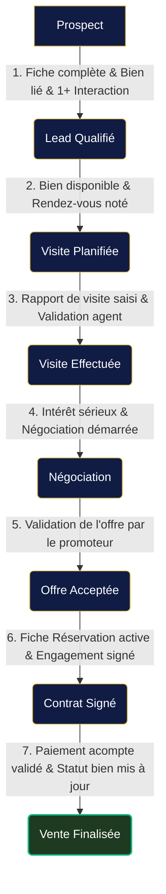
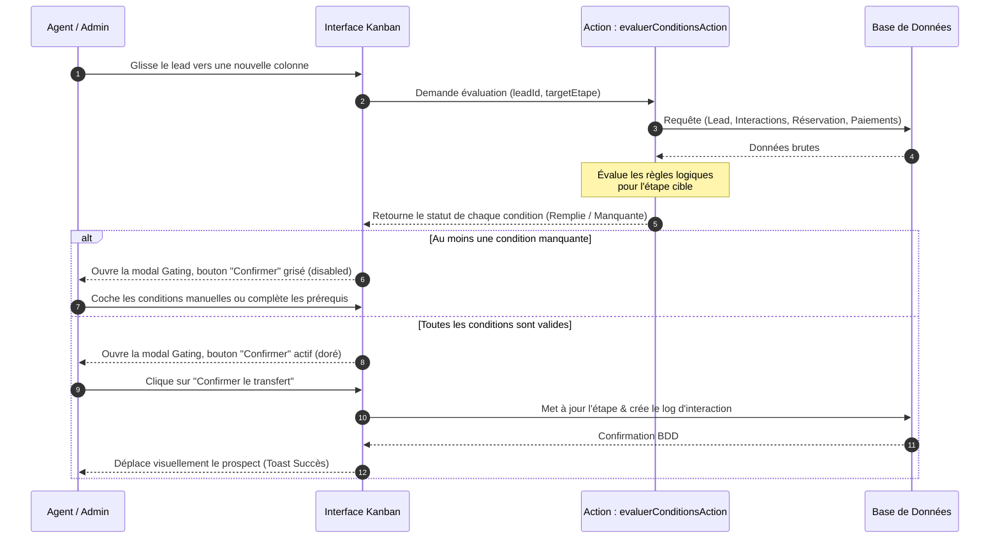

# Fonctionnalité : Pipeline de Vente Conditionnel (Transition Gating)

Cette fonctionnalité vise à transformer le tableau Kanban du CRM d'un simple tableau de bord visuel en un véritable **moteur de workflow qualitatif**. Le passage d'un prospect d'une étape à une autre n'est plus libre : il est soumis à la validation de conditions métier obligatoires.

---

## 1. 🔍 Radiographie d'Impact 3D

Conformément au protocole `PROMPTS/ADD_NEW_FEATURE.md`, voici l'analyse d'impact :

### Axe 1 : Radio Technique
* **Fichiers modifiés** :
  * `src/lib/db/schema.ts` : Ajout de colonnes de contrôle qualité sur la table `leads` (ex. `visiteConfirmee`, `offreValidee`, `engagementSigne`).
  * `src/app/actions/leads.ts` : Ajout d'une action serveur `evaluerConditionsAction(leadId: string, targetEtape: string)` pour calculer l'état des conditions côté serveur. Mise à jour de `modifierEtapeLeadAction` pour interdire le passage si les conditions obligatoires ne sont pas remplies.
  * `src/components/admin/KanbanPipeline.tsx` : Intégration de la modal de validation interactive lors du Drag & Drop ou des actions fléchées.
  * `src/components/admin/LeadsManagerClient.tsx` : Gestion de l'état de la modal de validation.
* **Risques de régression** :
  * Le glisser-déposer immédiat sans confirmation doit être suspendu au profit de l'ouverture de la modal si des conditions sont requises.
  * Les modifications directes de l'étape depuis le tableau standard doivent également respecter ces vérifications.

### Axe 2 : Radio Métier & Données
* **Impact sur les relations DB** :
  * Utilisation croisée des données de la table `leads`, `lead_interactions`, `reservations`, et `paiements` pour valider dynamiquement les conditions.
  * Maintien de l'intégrité : un prospect ne peut pas être marqué comme "Vente Finalisée" si le bien d'intérêt est toujours marqué disponible ou s'il n'y a aucun paiement au statut `'paye'`.
* **Processus client de bout en bout** :
  * En Côte d'Ivoire, les étapes OHADA de vente immobilière imposent des jalons précis (Réservation signée, Acompte reçu). Ce système garantit que les commerciaux saisissent scrupuleusement les contrats et paiements avant de déclarer la transaction clôturée.

### Axe 3 : Radio UX/UI (Premium Navy & Gold)
* **Changements d'états** :
  * Ouverture d'une modal élégante (Glassmorphism, fond sombre navy avec liseré or) affichant la liste des conditions.
  * Indicateurs visuels : pastille verte avec checkmark doré pour les conditions remplies ; pastille rouge avec icône d'avertissement pour les conditions manquantes.
  * Le bouton de confirmation final brille d'une lueur dorée lorsqu'il est actif, et devient gris ardoise mat/désactivé si des conditions manquent.

---

## 2. 📋 Logique Métier & Conditions par Étape

Voici l'analyse des conditions nécessaires et suffisantes pour franchir chaque jalon :

| Transition | Étape Cible | Conditions Fonctionnelles | Type de Contrôle |
| :--- | :--- | :--- | :--- |
| **1 ➔ 2** | **Lead Qualifié** | 1. Fiche du prospect complète (Nom, Prénom, E-mail, Téléphone) 2. Un bien d'intérêt est assigné (`bienInteresse` non nul) 3. Au moins 1 interaction qualifiante enregistrée (appel/email/whatsapp) | Automatique (DB) |
| **2 ➔ 3** | **Visite Planifiée** | 1. Le bien d'intérêt est toujours au statut `'disponible'` 2. Une interaction contenant les détails de la planification de visite est enregistrée | Automatique (DB) |
| **3 ➔ 4** | **Visite Effectuée** | 1. Une interaction contenant le compte-rendu de visite est rédigée 2. L'agent confirme manuellement que la visite a eu lieu | Mixte (Interaction + Clic) |
| **4 ➔ 5** | **Négociation** | 1. Le budget ou l'offre initiale du client est mentionné dans les notes 2. L'agent valide l'intérêt sérieux d'achat | Mixte |
| **5 ➔ 6** | **Offre Acceptée** | 1. L'offre écrite a été validée par la direction / le promoteur immobilier | Manuel (Checkbox Agent) |
| **6 ➔ 7** | **Contrat Signé** | 1. Une réservation (`reservations`) est créée en DB pour ce client/bien 2. Le contrat d'engagement ou de réservation est signé | Automatique + Manuel |
| **7 ➔ 8** | **Vente Finalisée** | 1. Au moins un paiement (`paiements`) au statut `'paye'` est associé à la réservation 2. Le statut du bien associé passe à `'vendu'` ou `'reserve'` | Automatique (DB) |

---

## 3. 📊 Diagrammes de Flux (Mermaid)

### Flux des Phases et Conditions

### Diagramme de Séquence de Validation

---

## 4. 🛠️ Plan d'Action & Découpage pas-à-pas (Blocs Robustes)

Pour assurer une stabilité absolue du code existant sans introduire de régression, l'implémentation est découpée en **5 Blocs Robustes** autonomes :

### Bloc 1 : Extension du Schéma de Données (DB)
* Ajouter les colonnes de contrôle à la table `leads` dans `schema.ts` :
  * `visiteConfirmee` (boolean, default false) : Validation manuelle de la présence physique.
  * `offreValidee` (boolean, default false) : Validation formelle de l'offre d'achat.
  * `engagementSigne` (boolean, default false) : Validation de la signature du contrat.
* Générer la migration Drizzle et l'appliquer en base.

### Bloc 2 : Moteur d'Évaluation (Server Action)
* Écrire l'action `evaluerConditionsAction(leadId: string, targetEtape: string)` dans `leads.ts`.
* Cette fonction doit :
  1. Lire le prospect par son ID.
  2. Compter ses interactions dans `lead_interactions`.
  3. Chercher si un bien est associé (`bienInteresse`).
  4. Récupérer le profil utilisateur (si existant avec même email/téléphone) pour vérifier les réservations actives ou paiements validés.
  5. Retourner un tableau de conditions : `{ id, label, valid: boolean, type: 'auto'|'manual' }`.

### Bloc 3 : Composant UI - La Modal de Gating (`TransitionGatingModal.tsx`)
* Créer un composant premium et accessible qui :
  * Reçoit la liste des conditions et l'état de chargement.
  * Permet de modifier les cases de contrôle manuelles directement depuis l'interface (avec appel de mise à jour en arrière-plan).
  * Affiche un design moderne : fond sombre navy, liserés dorés et flous d'arrière-plan (glassmorphism).
  * Active/désactive dynamiquement le bouton de validation finale.

### Bloc 4 : Intégration Kanban ↔ Modal
* Modifier `LeadsManagerClient.tsx` et `KanbanPipeline.tsx` :
  * Intercepter l'action de drop ou de clic sur les boutons tactiles.
  * Au lieu d'appeler directement le changement d'étape, ouvrir `TransitionGatingModal`.
  * En cas d'annulation ou de fermeture, replacer la carte Kanban à son emplacement d'origine (rollback de l'état réactif local).
  * En cas de confirmation, appeler `modifierEtapeLeadAction` puis fermer la modal.

### Bloc 5 : Validation & Tests de Robustesse
* Valider la compilation complète (TS + Lint).
* Écrire un scénario de test pour s'assurer que le glissement vers "Lead Qualifié" est bien bloqué si aucune interaction de qualification n'est enregistrée.
